<!-- md_merge {{chapter:+}} {{title:PPT & MD merger とは？}} -->
<!-- #id:chapter:AUTOCHAPTER:AUTOID_1 -->
# 1) PPT & MD merger とは？

<!-- source: extracted/ppt_md_merger_overview_slide1_md.md -->
<!-- #id:section:ppt_md_merger_overview:slide1 -->
## 1.1) PPT \& MD merger とは？

PPT \& MD merger は、「pptxファイルを文書部品として扱い、多様な形式の文書を生成できるジェネレーター」 です。　（ツールそのものは Python スクリプトであり、Windows + PowerPoint 環境で動作します）

```{=latex}
\begin{center}
```

{ width=95% }

```{=latex}
\end{center}
```

何はともあれ使ってみたい、という場合は　[5) Requirements \& Quick Start](#5-requirements--quick-start) をご覧ください。システム要件、インストール方法、Quick Start ガイド、11種類のサンプルデータの案内があります。

何やら変わったコンセプトっぽいから、そこからじっくり知りたいという場合はこのまま次の [2) 大きな PowerPointファイ ルを作る時の悩みとは？](#2-%E5%A4%A7%E3%81%8D%E3%81%AApowerpoint%E3%83%95%E3%82%A1%E3%82%A4%E3%83%AB%E3%82%92%E4%BD%9C%E3%82%8B%E6%99%82%E3%81%AE%E6%82%A9%E3%81%BF%E3%81%A8%E3%81%AF) へ進んでください。

何ができるツールなのか詳細に知りたい場合は[5.4) Examples](#54-examples)から機能別詳細解説に飛べます。

ただし、現時点での機能解説は PPTX をマージ生成する例のみで、MD,PDF,HTML 等の他形式文書を生成する例の解説は作っておりません。機能としては動いていますが設定が複雑なため、ドキュメントを書くのに少し時間がかかる見込みです。（[仕様書](/docs/md_merge_spec.md)はありますが、これを読んで使い方が分かるかというと難しいです）

<!-- md_merge {{chapter:+}} {{title:大きなPowerPointファイルを作る時の悩みとは？}} -->
<!-- #id:chapter:AUTOCHAPTER:AUTOID_2 -->
# 2) 大きなPowerPointファイルを作る時の悩みとは？

<!-- source: extracted/ppt_md_merger_overview_slide2_md.md -->
<!-- #id:section:ppt_md_merger_overview:slide2 -->
## 2.1) どんな人のためのツール？

このツールは、研修用テキストや業務マニュアルなど、「仕事を教える、手順を決める」ための資料を PowerPoint で大量に作る企業/個人のためのツールです。

その種のテキストを作る時によくある悩みとはなんでしょう？

```{=latex}
\begin{center}
```

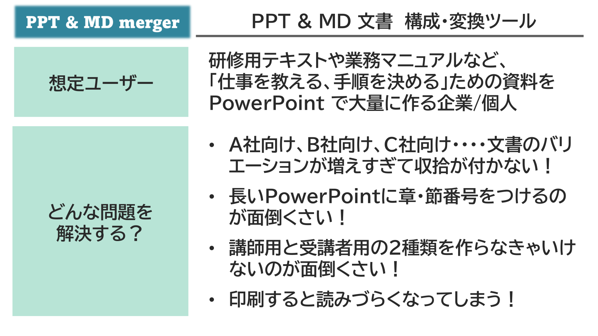{ width=95% }

```{=latex}
\end{center}
```

たとえば、文書のバリエーションが増えすぎて収集がつかなくなる。　章・節番号をつけるのが面倒くさい。　講師用と受講者用の2種類を作らなきゃいけないのが面倒くさい！

こんな問題を解決するために作ったツールです。

そのために、「pptxファイルを文書部品として扱い、必要に応じて結合する」 というコンセプトを採用したものです。まずはその背景から詳しくお話ししましょう。

<!-- source: D:/DOCS/SWPJs/new_md_merge/defaults/common_assets/tex_newpage.md -->

\newpage


<!-- source: extracted/ppt_md_merger_overview_slide3_md.md -->
<!-- #id:section:ppt_md_merger_overview:slide3 -->
## 2.2) 悩み１： ちょっとずつ違うPowerPointのコピーが増殖

PowerPoint で研修用のテキストを作るときは、こんな悩みがよくあります。（研修用テキストに限りませんが）

Ａ社向けに作ったテキストをコピー＋ちょっと修正してＢ社向けを作り、それをまたコピー＋ちょっと修正してＣ社向けを作り、・・・・ということを繰り返すわけです。すると、ちょっとずつ違うバージョンが無数に増えてしまい、収拾がつかなくなってしまいます。

「ちょっと修正」 の中にはそのまま永続的に使うものもあれば、そのときだけの臨時の修正もあり、それを区別しておかないと **「あれ？　以前、ここのところ直したはずだったんだけど・・・」**　という問題が起きてしまいます。

```{=latex}
\begin{center}
```

{ width=90% }

```{=latex}
\end{center}
```

結局、コピーが増殖すると、どれをマスター原本にしたら良いのか分かりません。

さらに、企業研修は同じ講座を定期的に行うことが多いので、「Ａ、Ｂ、Ｃ社向け」 をそれぞれメンテナンスしなければいけないのですが、すべてコピーですから、同じ修正をすべてに行う必要があり、とても面倒です。

<!-- source: D:/DOCS/SWPJs/new_md_merge/defaults/common_assets/tex_newpage.md -->

\newpage


<!-- source: extracted/ppt_md_merger_overview_slide4_md.md -->
<!-- #id:section:ppt_md_merger_overview:slide4 -->
## 2.3) 悩み２： 章・節番号をつけるのが面倒くさい

また別な悩みもあります。研修用テキストはページ数が多いので章・節番号をつけたくなるのですが、PowerPointにはWordのような自動付番機能がないので、手作業でやらなければなりません。

```{=latex}
\begin{center}
```

{ width=95% }

```{=latex}
\end{center}
```

プレゼン用の資料なら20ページ程度で済むことが多いですが、研修テキストでは100ページを超えることもよくあります。ページの追加/削除があるたびに手動で付番しなおすのは大変な手間がかかります。

<!-- source: D:/DOCS/SWPJs/new_md_merge/defaults/common_assets/tex_2line.md -->

\par\vspace{2\baselineskip}


<!-- source: extracted/ppt_md_merger_overview_slide5_md.md -->
<!-- #id:section:ppt_md_merger_overview:slide5 -->
## 2.4) なんとかこの悩みを解決できないか？

つまり悩みはおおまかに

1. コピー増殖問題
1. 章節番号問題

の2つです。なんとかこれを解決できないか？　と考えて、

```{=latex}
\begin{center}
```

{ width=80% }

```{=latex}
\end{center}
```

PowerPoint 部品マージツール、 PPT \& MD merger を作りました！

<!-- md_merge {{chapter:+}} {{title:問題構造の整理と解決策}} -->
<!-- #id:chapter:AUTOCHAPTER:AUTOID_3 -->
# 3) 問題構造の整理と解決策

<!-- source: extracted/ppt_md_merger_overview_slide6_md.md -->
<!-- #id:section:ppt_md_merger_overview:slide6 -->
## 3.1) まずは問題の構造を整理すると・・・

いったん、問題の構造を整理しましょう。

大きなPowerPointファイルも実際は小さな部品の集合体です。

```{=latex}
\begin{center}
```

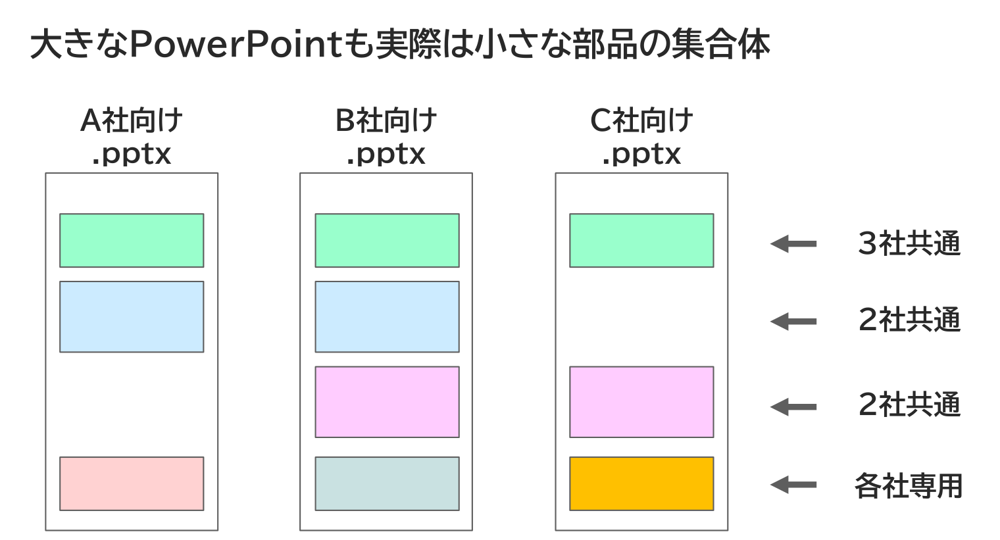{ width=80% }

```{=latex}
\end{center}
```

たとえばＡ社向け、Ｂ、Ｃ社向けと3種類の .pptx があるとして、その中には３社共通の部品もあれば２社共通の部品、各社専用の部品もあります。その組合せが各社違うということです。

<!-- source: extracted/ppt_md_merger_overview_slide7_md.md -->
<!-- #id:section:ppt_md_merger_overview:slide7 -->
## 3.2) 部品を組み合わせて完成版を構成する仕組みを作る

そこで、部品の組み合わせを自動的に結合（マージ）して完成版を作れるしくみがあれば良さそうです。

pptx部品単位でマスターを管理し、更新は必ずマスターに対して行うようにします。そうすれば 「○○社向け構成」 が何百種類あってもマージするだけで完成版ができるので、自動的に各社向け完成版に反映可能です。

```{=latex}
\begin{center}
```

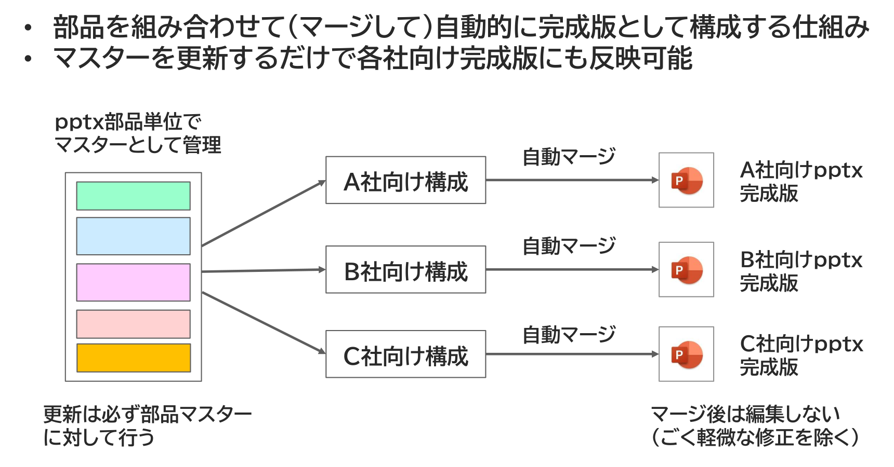{ width=95% }

```{=latex}
\end{center}
```

したがって、原則としてマージ後は編集しません。（その場限りで捨てるような語句軽微な修正はしてもかまいませんが）

<!-- source: D:/DOCS/SWPJs/new_md_merge/defaults/common_assets/tex_2line.md -->

\par\vspace{2\baselineskip}


<!-- source: extracted/ppt_md_merger_overview_slide8_md.md -->
<!-- #id:section:ppt_md_merger_overview:slide8 -->
## 3.3) 自動マージするときに章・節番号を付与する

自動マージするときに章/節番号の付与もできます。

```{=latex}
\begin{center}
```

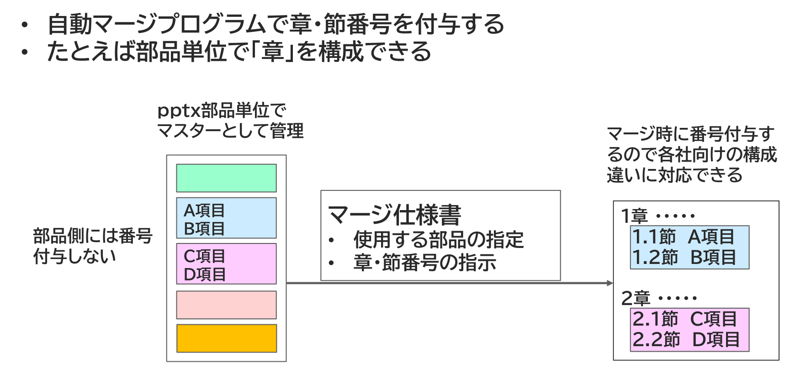{ width=95% }

```{=latex}
\end{center}
```

部品側には番号を付与せず、マージ時に付番するので各社向けの構成の違いにも対応できます。

<!-- source: D:/DOCS/SWPJs/new_md_merge/defaults/common_assets/tex_2line.md -->

\par\vspace{2\baselineskip}


<!-- source: extracted/ppt_md_merger_overview_slide9_md.md -->
<!-- #id:section:ppt_md_merger_overview:slide9 -->
## 3.4) 補助機能：変数置換

さらに変数置換機能をつけました。 pptx部品上で特殊な書式で変数を書いておくと、その内容をマージ仕様書の設定にしたがって書き換えられます。

```{=latex}
\begin{center}
```

{ width=90% }

```{=latex}
\end{center}
```

仕向先別のバリエーションをこの方法でも吸収することができます。

<!-- source: D:/DOCS/SWPJs/new_md_merge/defaults/common_assets/tex_newpage.md -->

\newpage


<!-- source: extracted/ppt_md_merger_overview_slide10_md.md -->
<!-- #id:section:ppt_md_merger_overview:slide10 -->
## 3.5) 補助機能： シェイプ/スライドの自動削除

もう1つ、研修テキストを作る時に嬉しいのがシェイプ／スライドの自動削除機能です。 これは、「同じテキストを研修用/講師用で生成し分ける」 ために使えます。

研修テキストというのは、配付資料にすべての情報を載せないのが普通です。人間は自分で書いた情報の方が記憶に残るので、重要な情報は配付資料に載せず受講者自身の手で書かせることが多いのですが、そのために2種類のpptxを作るとこれは 「コピー増殖問題」 そのものであり、整合性を維持するのが非常に面倒です。

そこで、このシェイプ／スライド自動削除機能です。配付資料には載せたくないシェイプ／スライドに特殊マーカーを記入しておくと、オプションひとつでそれを削除したバージョン、残ったバージョンを自動生成可能です。

```{=latex}
\begin{center}
```

{ width=95% }

```{=latex}
\end{center}
```

マスターは1つだけで、生成物が変わるだけですから、コピー増殖問題は起きません。

<!-- source: D:/DOCS/SWPJs/new_md_merge/defaults/common_assets/tex_newpage.md -->

\newpage


<!-- source: extracted/ppt_md_merger_overview_slide11_md.md -->
<!-- #id:section:ppt_md_merger_overview:slide11 -->
## 3.6) 補助機能： 一時メモ用シェイプの自動削除

シェイプ/スライド自動削除機能の派生形で、オプションの有無を問わず必ず削除されるシェイプを作る特殊マーカーもあります。

長い研修テキストの制作中には、 「とりあえずたたき台を書いておくけど、必ず直前に最終確認しろ！」 というような事項がどうしても出てくるものです。 紙の資料なら付箋紙を貼るところですがデジタル文書ではそれができない。 そこでパワポ資料では付箋紙代わりに目立つ図形にそうした注意書きを書いて残しておいたりしますが、これは本番資料からは必ず削除しなければならないもの。

ところが・・・そう、残ってしまうことがあるんですね。

```{=latex}
\begin{center}
```

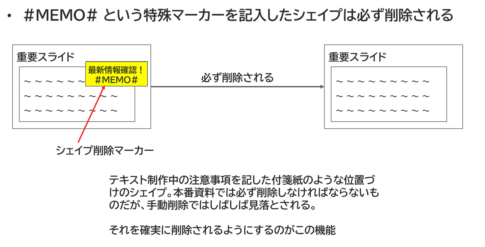{ width=90% }

```{=latex}
\end{center}
```

そこで、この一時メモ用シェイプの自動削除機能です。これを使えば必ず削除されるので安心です。

<!-- md_merge {{chapter:+}} {{title:現時点の機能解説はPPTX生成機能のみ}} -->
<!-- #id:chapter:AUTOCHAPTER:AUTOID_4 -->
# 4) 現時点の機能解説はPPTX生成機能のみ

<!-- source: extracted/ppt_md_merger_overview_slide12_md.md -->
<!-- #id:section:ppt_md_merger_overview:slide12 -->
## 4.1) PPTX生成機能と、その他の形式文書生成機能

なお、PPT\&MD merger は大まかに PPTX生成と他形式（PDF,MD,HTML)生成の２つの機能に分かれています。 PPTX生成はPPTX形式だけで完結しますが、他形式生成のほうはいったんMarkdown形式を出力して結合するので別系統の機能として構築したもので、設定方法等も少々複雑です。
現時点で詳しい（図版つき）機能解説を用意しているのはPPTX生成の範囲のみで、他形式分については準備中です。ただし、他形式生成も図版つき解説がないだけで、機能としては動いているので、詳細スペック文書やサンプルを読んでいただけば、使い方は察しがつくかもしれません。（かもしれません・・・・・保証はしない(^_^;)　まあ、おいおい書きますよ）

```{=latex}
\begin{center}
```

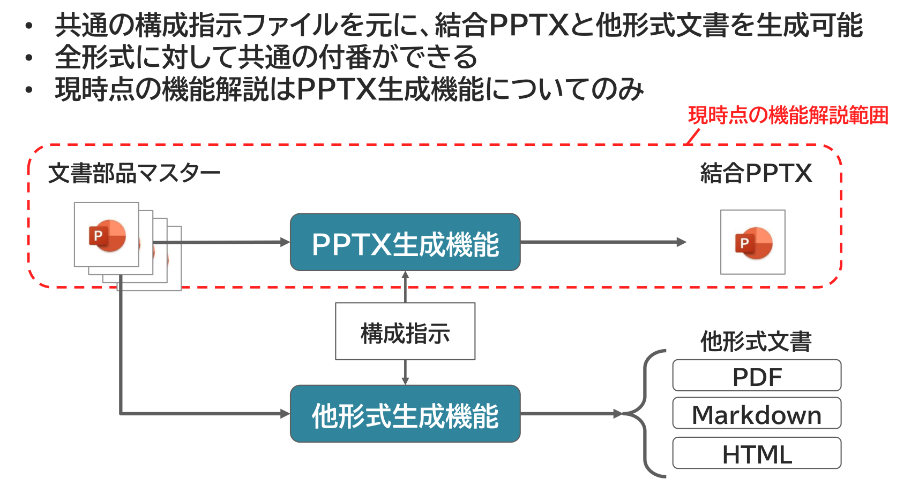{ width=95% }

```{=latex}
\end{center}
```

以下、PPTX生成機能の詳細解説、および他形式生成機能も含む詳細スペック文書へのリンク一覧です。　しかし、「詳細を読むよりまず試しに使ってみたい」　という場合はこの後の Quick Start をご覧ください。

<!-- md_merge {{chapter:+}} {{title:Requirements & Quick Start}} -->
<!-- #id:chapter:AUTOCHAPTER:AUTOID_5 -->
# 5) Requirements & Quick Start

<!-- source: extracted/ppt_md_merger_overview_slide13_md.md -->
<!-- #id:section:ppt_md_merger_overview:slide13 -->
## 5.1) システム要件

PPTX生成機能のみ、とりあえず試してみるための手順を示します。

PPT \& MD merger のシステム要件です。

### OS

```md
Windows10/11
```

### Software

Python 3.11以上

```md
Microsoft PowerPoint Desktop版
  - Microsoft 365
  - PowerPoint 2021 など
```


```md
Test環境
  - Windows 11
  - Python 3.14
  - PowerPoint for Microsoft 365
```

<!-- source: D:/DOCS/SWPJs/new_md_merge/defaults/common_assets/tex_newpage.md -->

\newpage


<!-- source: extracted/ppt_md_merger_overview_slide14_md.md -->
<!-- #id:section:ppt_md_merger_overview:slide14 -->
## 5.2) インストール方法

### 1. Clone repository

```bash
git clone https://github.com/USERNAME/ppt-md-merger.git
cd ppt-md-merger
```

### 2. Create virtual environment

python仮想環境の構築
```powershell
python -m venv .venv
```

### 3. Activate virtual environment

仮想環境の有効化

```powershell
.venv\Scripts\Activate.ps1
```

仮想環境からの退出

```powershell
.venv\Scripts\deactivate.bat
```

### 4. Install package

```powershell
pip install -e .
```

<!-- source: D:/DOCS/SWPJs/new_md_merge/defaults/common_assets/tex_newpage.md -->

\newpage


<!-- source: extracted/ppt_md_merger_overview_slide15_md.md -->
<!-- #id:section:ppt_md_merger_overview:slide15 -->
## 5.3) Quick Start

### 1. Prepare parts pptx files

適当なpptxファイルを用意します。中身は何を書いてもかまいません。

```
parts/
├── 00_intro.pptx
├── 10_basic.pptx
└── 20_example.pptx
```

<!-- source: extracted/ppt_md_merger_overview_slide16_md.md -->
<!-- #id:subsection:ppt_md_merger_overview:slide16_2 --> 
### 5.3.1) 2. Create merge recipe YAML

PowerPointファイルを単純結合する結合指示書のサンプル

```
output: 
  pptxfilename: merged.pptx        # 結合後のpptxファイルのファイル名

procedure:
  - operation: insertpptx		 # 結合後対象のファイルを列挙する
    pptxfilename: 00_intro.pptx
  - operation: insertpptx
    pptxfilename: 10_basic.pptx
  - operation: insertpptx
    pptxfilename: 20_example.pptx
```

<!-- source: extracted/ppt_md_merger_overview_slide17_md.md -->
<!-- #id:subsection:ppt_md_merger_overview:slide17_3 --> -->
### 5.3.2) 3. Run merge

```
pptmdmerge pptmerge merge_recipe.yaml  [options]
```

```
options
  --log-level debug    設定ミス等を検証するために処理内容を確認したい場合、デバッグ表示を有効に
  --force              何度も作り直す場合は出力ファイルを上書きにする
```

### 4. output

```
merged.pptx
```

<!-- source: D:/DOCS/SWPJs/new_md_merge/defaults/common_assets/tex_newpage.md -->

\newpage


<!-- source: extracted/ppt_md_merger_overview_slide18_md.md -->
<!-- #id:section:ppt_md_merger_overview:slide18 -->
## 5.4) Examples

### 単純マージ

２つのファイルを単純に結合するサンプルです。

サンプルフォルダ：　pm1_simple_ppt_merge

[{ width=60% }](../../pm1_simple_ppt_merge/README.md)

```{=latex}
\par\vspace{5\baselineskip}
```

### 簡易ナンバリング

2つの pptx ファイルを結合してファイル単位で chapter としてナンバリングする機能のサンプルです。

サンプルフォルダ：　pm2_simple_numbering

[{ width=70% }](../../pm2_simple_numbering/README.md)


```{=latex}
\vfill
\newpage
```

### chapter_marker によるナンバリング

スライド上に埋め込んだ特殊文字列 #CHAPT#, #SECTION# で章・節番号のカウントを行う方法のサンプルです。

サンプルフォルダ：　pm3_chapter_marker_numbering

[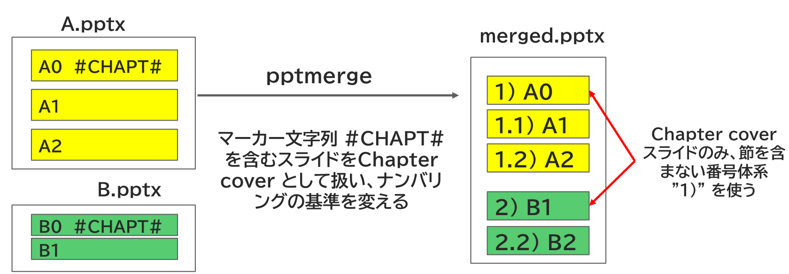{ width=90% }](../../pm3_chapter_marker_numbering/README.md)


```{=latex}
\par\vspace{5\baselineskip}
```

### スライド中の変数置換

スライド上に差し替え可能なプレースホルダーを用意しておき、設定ファイルの変数でそれを差し替え表示する方法のサンプルです。

サンプルフォルダ：　pm_variable_replacement

[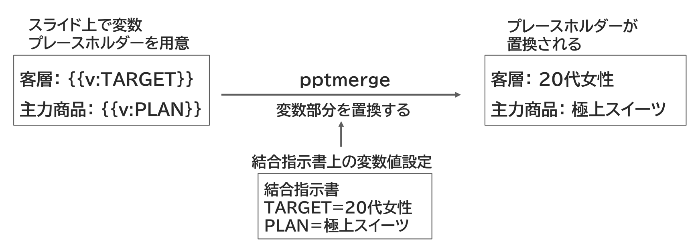{ width=90% }](../../pm4_variable_replacement/README.md)


```{=latex}
\vfill
\newpage
```

### Chapter Cover 挿入運用

本題のコンテンツの前に章とびら（Chapter Cover）を挿入する運用方法です。

サンプルフォルダ：　pm5_chapter_cover_insertion

[{ width=80% }](../../pm5_chapter_cover_insertion/README.md)


```{=latex}
\par\vspace{5\baselineskip}
```

### stylebaseを別に指定する機能

pptxファイルを結合する際、コンテンツとは別にスタイル情報のみ使用するファイルを別途指定する機能です。

サンプルフォルダ：　pm6_stylebase

[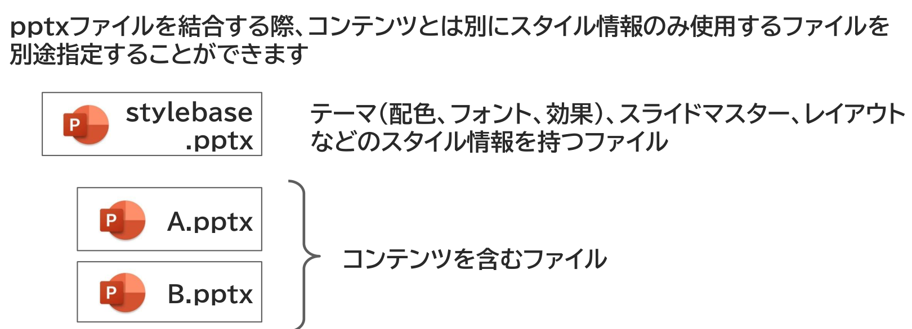{ width=90% }](../../pm6_stylebase/README.md)


```{=latex}
\vfill
\newpage
```

### ファイルの分割挿入機能

ファイル全体ではなく一部を選択して結合する機能です。

サンプルフォルダ：　pm7_splitted_insertion

[{ width=60% }](../../pm7_splitted_insertion/README.md)


```{=latex}
\par\vspace{5\baselineskip}
```

### 指定したシェイプを消去

配付資料には載せたくないシェイプを特殊マーカーで自動消去する機能です。

サンプルフォルダ：　pm8_delete_csp

[{ width=90% }](../../pm8_delete_csp/README.md)


```{=latex}
\vfill
\newpage
```

### 指定したスライドを削除

配付資料には載せたくないスライドを特殊マーカーで自動削除する機能です。

サンプルフォルダ：　pm9_delete_csl

[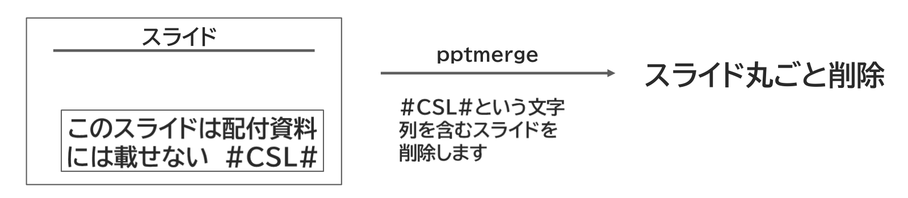{ width=90% }](../../pm9_delete_csl/README.md)


```{=latex}
\par\vspace{5\baselineskip}
```

### 作業用のメモを書く

原稿制作中の一時的メモなど、 「後で見直す部分に貼っておく付箋紙」 のような用途に使う機能です。

サンプルフォルダ：　pm10_memo_temp

[{ width=90% }](../../pm10_memo_temp/README.md)


```{=latex}
\vfill
\newpage
```

### 特殊定数を置換する

ソースpptxのファイル名やスライド番号、スライドタイトルに置換される特殊定数機能です。

サンプルフォルダ：　pm11_title_filename

[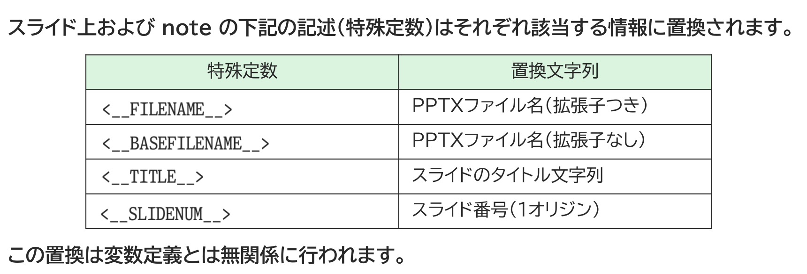{ width=90% }](../../pm11_title_filename/README.md)