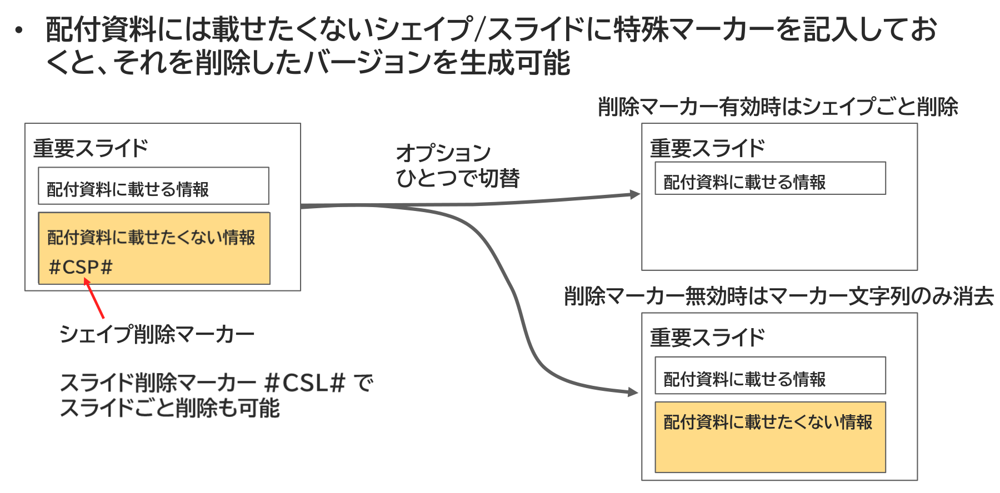

{{#id:section:ppt_md_merger_overview:slide10}}
## 補助機能： シェイプ/スライドの自動削除

もう1つ、研修テキストを作る時に嬉しいのがシェイプ／スライドの自動削除機能です。 これは、「同じテキストを研修用/講師用で生成し分ける」 ために使えます。

研修テキストというのは、配付資料にすべての情報を載せないのが普通です。人間は自分で書いた情報の方が記憶に残るので、重要な情報は配付資料に載せず受講者自身の手で書かせることが多いのですが、そのために2種類のpptxを作るとこれは 「コピー増殖問題」 そのものであり、整合性を維持するのが非常に面倒です。

そこで、このシェイプ／スライド自動削除機能です。配付資料には載せたくないシェイプ／スライドに特殊マーカーを記入しておくと、オプションひとつでそれを削除したバージョン、残ったバージョンを自動生成可能です。

```{=latex}
\begin{center}
```

{ width=95% }

```{=latex}
\end{center}
```

マスターは1つだけで、生成物が変わるだけですから、コピー増殖問題は起きません。