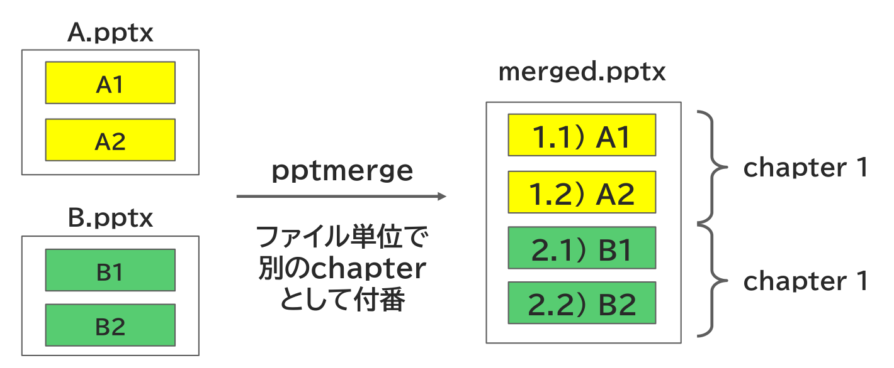
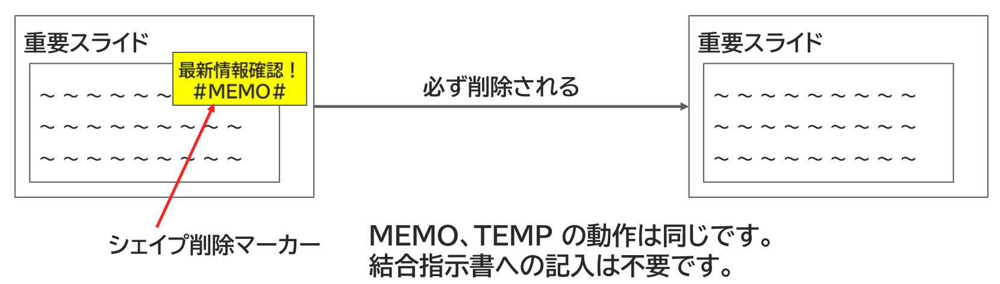

{{#id:section:ppt_md_merger_overview:slide18}}
## Examples

### 単純マージ

２つのファイルを単純に結合するサンプルです。

サンプルフォルダ：　pm1_simple_ppt_merge

[{ width=60% }](../../pm1_simple_ppt_merge/README.md)

```{=latex}
\par\vspace{5\baselineskip}
```

### 簡易ナンバリング

2つの pptx ファイルを結合してファイル単位で chapter としてナンバリングする機能のサンプルです。

サンプルフォルダ：　pm2_simple_numbering

[{ width=70% }](../../pm2_simple_numbering/README.md)


```{=latex}
\vfill
\newpage
```

### chapter_marker によるナンバリング

スライド上に埋め込んだ特殊文字列 #CHAPT#, #SECTION# で章・節番号のカウントを行う方法のサンプルです。

サンプルフォルダ：　pm3_chapter_marker_numbering

[{ width=90% }](../../pm3_chapter_marker_numbering/README.md)


```{=latex}
\par\vspace{5\baselineskip}
```

### スライド中の変数置換

スライド上に差し替え可能なプレースホルダーを用意しておき、設定ファイルの変数でそれを差し替え表示する方法のサンプルです。

サンプルフォルダ：　pm_variable_replacement

[{ width=90% }](../../pm4_variable_replacement/README.md)


```{=latex}
\vfill
\newpage
```

### Chapter Cover 挿入運用

本題のコンテンツの前に章とびら（Chapter Cover）を挿入する運用方法です。

サンプルフォルダ：　pm5_chapter_cover_insertion

[{ width=80% }](../../pm5_chapter_cover_insertion/README.md)


```{=latex}
\par\vspace{5\baselineskip}
```

### stylebaseを別に指定する機能

pptxファイルを結合する際、コンテンツとは別にスタイル情報のみ使用するファイルを別途指定する機能です。

サンプルフォルダ：　pm6_stylebase

[{ width=90% }](../../pm6_stylebase/README.md)


```{=latex}
\vfill
\newpage
```

### ファイルの分割挿入機能

ファイル全体ではなく一部を選択して結合する機能です。

サンプルフォルダ：　pm7_splitted_insertion

[{ width=60% }](../../pm7_splitted_insertion/README.md)


```{=latex}
\par\vspace{5\baselineskip}
```

### 指定したシェイプを消去

配付資料には載せたくないシェイプを特殊マーカーで自動消去する機能です。

サンプルフォルダ：　pm8_delete_csp

[{ width=90% }](../../pm8_delete_csp/README.md)


```{=latex}
\vfill
\newpage
```

### 指定したスライドを削除

配付資料には載せたくないスライドを特殊マーカーで自動削除する機能です。

サンプルフォルダ：　pm9_delete_csl

[{ width=90% }](../../pm9_delete_csl/README.md)


```{=latex}
\par\vspace{5\baselineskip}
```

### 作業用のメモを書く

原稿制作中の一時的メモなど、 「後で見直す部分に貼っておく付箋紙」 のような用途に使う機能です。

サンプルフォルダ：　pm10_memo_temp

[{ width=90% }](../../pm10_memo_temp/README.md)


```{=latex}
\vfill
\newpage
```

### 特殊定数を置換する

ソースpptxのファイル名やスライド番号、スライドタイトルに置換される特殊定数機能です。

サンプルフォルダ：　pm11_title_filename

[{ width=90% }](../../pm11_title_filename/README.md)