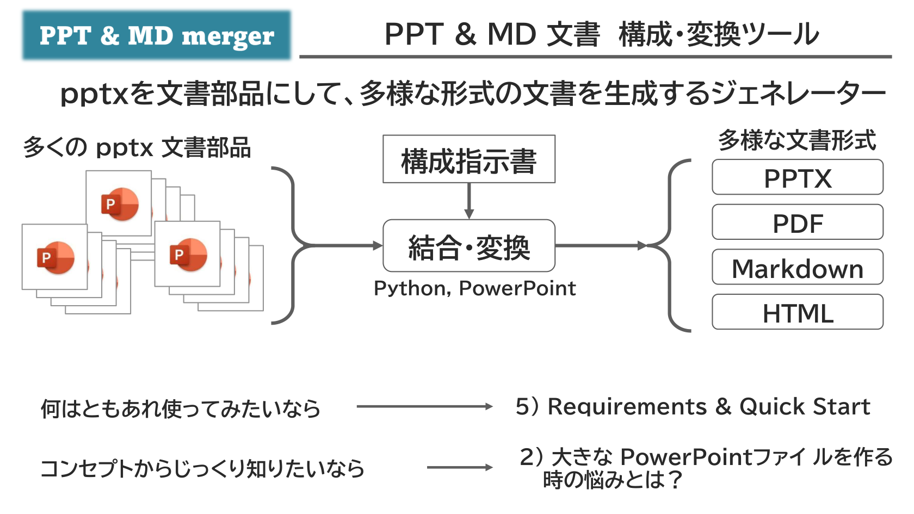

{{#id:section:ppt_md_merger_overview:slide1}}
## PPT \& MD merger とは？

PPT \& MD merger は、「pptxファイルを文書部品として扱い、多様な形式の文書を生成できるジェネレーター」 です。　（ツールそのものは Python スクリプトであり、Windows + PowerPoint 環境で動作します）

```{=latex}
\begin{center}
```

{ width=95% }

```{=latex}
\end{center}
```

何はともあれ使ってみたい、という場合は　[5) Requirements \& Quick Start](#5-requirements--quick-start) をご覧ください。システム要件、インストール方法、Quick Start ガイド、11種類のサンプルデータの案内があります。

何やら変わったコンセプトっぽいから、そこからじっくり知りたいという場合はこのまま次の [2) 大きな PowerPointファイ ルを作る時の悩みとは？](#2-%E5%A4%A7%E3%81%8D%E3%81%AApowerpoint%E3%83%95%E3%82%A1%E3%82%A4%E3%83%AB%E3%82%92%E4%BD%9C%E3%82%8B%E6%99%82%E3%81%AE%E6%82%A9%E3%81%BF%E3%81%A8%E3%81%AF) へ進んでください。

何ができるツールなのか詳細に知りたい場合は[5.4) Examples](#54-examples)から機能別詳細解説に飛べます。

ただし、現時点での機能解説は PPTX をマージ生成する例のみで、MD,PDF,HTML 等の他形式文書を生成する例の解説は作っておりません。機能としては動いていますが設定が複雑なため、ドキュメントを書くのに少し時間がかかる見込みです。（[仕様書](docs/md_merge_spec.md)はありますが、これを読んで使い方が分かるかというと難しいです）