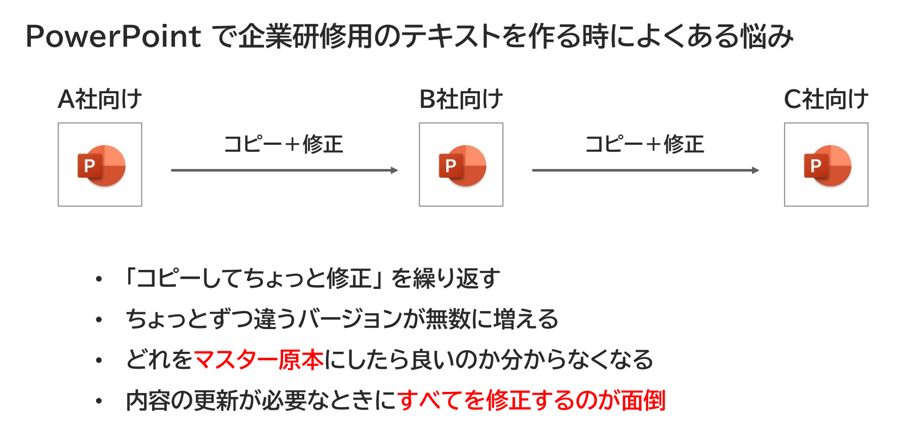

{{#id:section:ppt_md_merger_overview:slide3}}
## 悩み１： ちょっとずつ違うPowerPointのコピーが増殖

PowerPoint で研修用のテキストを作るときは、こんな悩みがよくあります。（研修用テキストに限りませんが）

Ａ社向けに作ったテキストをコピー＋ちょっと修正してＢ社向けを作り、それをまたコピー＋ちょっと修正してＣ社向けを作り、・・・・ということを繰り返すわけです。すると、ちょっとずつ違うバージョンが無数に増えてしまい、収拾がつかなくなってしまいます。

「ちょっと修正」 の中にはそのまま永続的に使うものもあれば、そのときだけの臨時の修正もあり、それを区別しておかないと **「あれ？　以前、ここのところ直したはずだったんだけど・・・」**　という問題が起きてしまいます。

```{=latex}
\begin{center}
```

{ width=90% }

```{=latex}
\end{center}
```

結局、コピーが増殖すると、どれをマスター原本にしたら良いのか分かりません。

さらに、企業研修は同じ講座を定期的に行うことが多いので、「Ａ、Ｂ、Ｃ社向け」 をそれぞれメンテナンスしなければいけないのですが、すべてコピーですから、同じ修正をすべてに行う必要があり、とても面倒です。