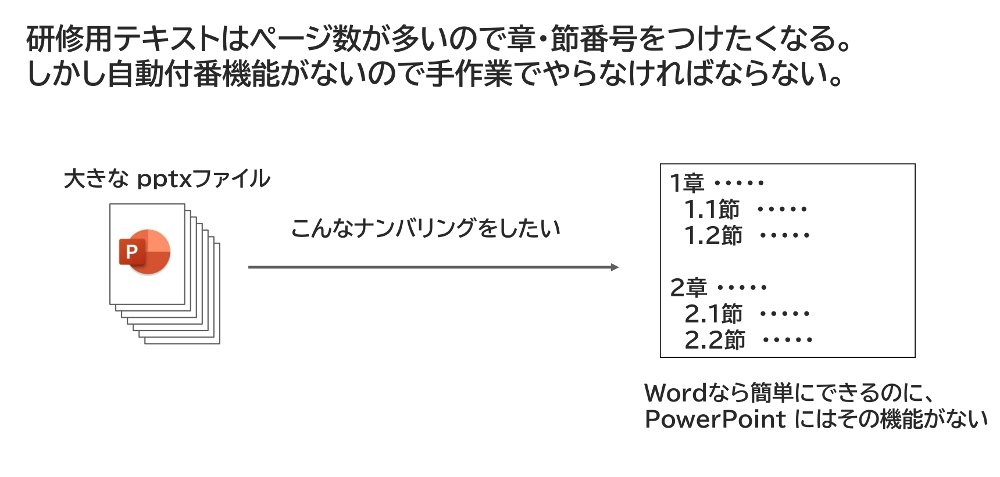

{{#id:section:ppt_md_merger_overview:slide4}}
## 悩み２： 章・節番号をつけるのが面倒くさい

また別な悩みもあります。研修用テキストはページ数が多いので章・節番号をつけたくなるのですが、PowerPointにはWordのような自動付番機能がないので、手作業でやらなければなりません。

```{=latex}
\begin{center}
```

{ width=95% }

```{=latex}
\end{center}
```

プレゼン用の資料なら20ページ程度で済むことが多いですが、研修テキストでは100ページを超えることもよくあります。ページの追加/削除があるたびに手動で付番しなおすのは大変な手間がかかります。