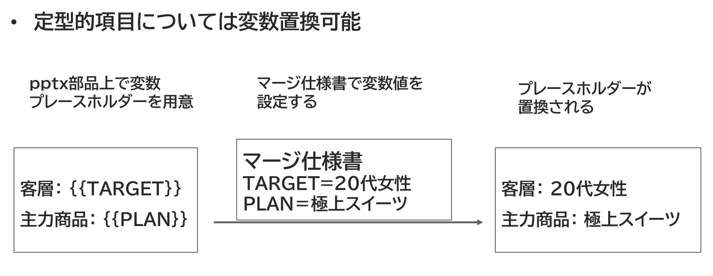

{{#id:section:ppt_md_merger_overview:slide9}}
## 補助機能：変数置換

さらに変数置換機能をつけました。 pptx部品上で特殊な書式で変数を書いておくと、その内容をマージ仕様書の設定にしたがって書き換えられます。

```{=latex}
\begin{center}
```

{ width=90% }

```{=latex}
\end{center}
```

仕向先別のバリエーションをこの方法でも吸収することができます。