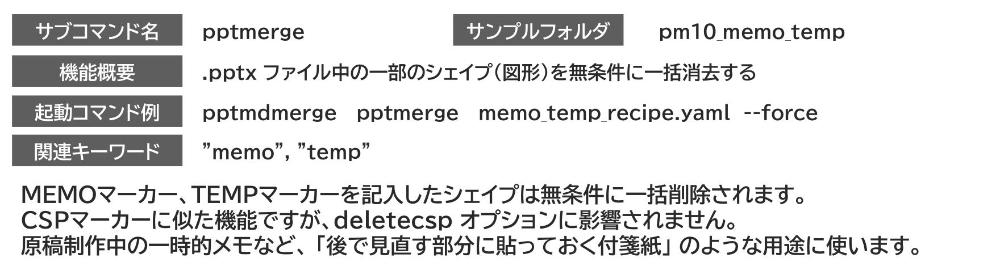

{{#id:section:memo_temp_guide:slide1}}
## 作業用のメモを書く

長い研修テキストの制作中には、 「とりあえずたたき台を書いておくけど、必ず直前に最終確認しろ！」 というような事項がどうしても出てくるものです。 紙の資料なら付箋紙を貼るところですがデジタル文書ではそれができない。 そこでパワポ資料では付箋紙代わりに目立つ図形にそうした注意書きを書いて残しておいたりしますが、これは本番資料からは必ず削除しなければならないもの。

ところが・・・そう、残ってしまうことがあるんですね。

そこで、MEMO/TEMPマーカーです。 #MEMO# または #TEMP# という文字列を含むシェイプは deletecsp に関係なく必ず削除されます。

MEMO、TEMP の動作は同じです。

結合指示書への記入は不要です。


```{=latex}
\par\vspace{1\baselineskip}
\begin{center}
```

{ width=95% }

{ width=90% }


```{=latex}
\end{center}
\par\vspace{1\baselineskip}
```