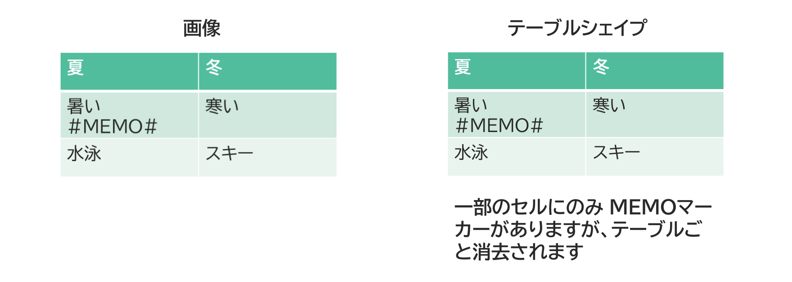

{{#id:section:memo_temp_guide:slide3}}
## テーブルシェイプはテーブルごと消去

テーブルセルに MEMO, TEMPマーカーがある場合は、テーブルごと消去されます。
（PDFファイル中では両方とも残って見えますが、マージされた .pptx からは削除されます）

```{=latex}
\par\vspace{1\baselineskip}
\begin{center}
```

{ width=95% }

```{=latex}
\end{center}
\par\vspace{1\baselineskip}
```