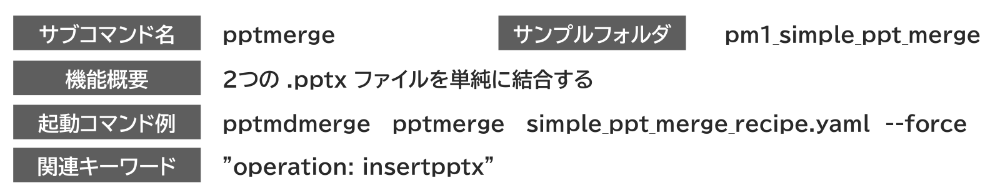
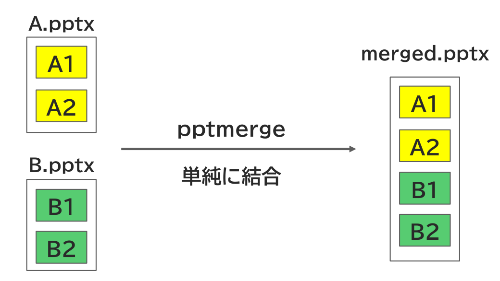

{{#id:section:simple_ppt_merge_guide:slide1}}
## pptmerge　単純マージ

単純マージは２つのpptxファイルを単に結合するだけの、最も単純な機能です。

結合指示書には関連キーワード欄の命令を使って結合対象ファイルを記載します。これについては後述します。

処理のイメージは下記の通りです。

```{=latex}
\begin{center}
```

{ width=95% }

{ width=60% }


```{=latex}
\end{center}
```