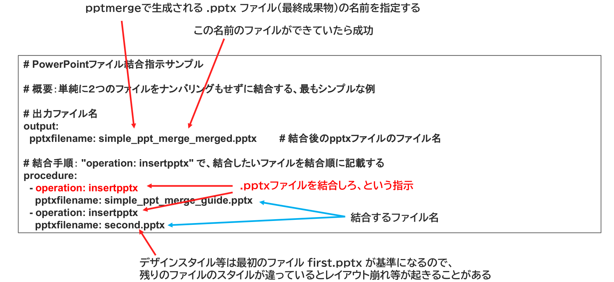

{{#id:section:simple_ppt_merge_guide:slide4}}
## 結合指示書サンプル

結合指示書では、output.pptxfilename: に結合後のpptxファイル名を記載し、
procedureセクションに　operation: insertpptx の配列で結合対象ファイルを記載します。

```{=latex}
\begin{center}
```

{ width=95% }

```{=latex}
\end{center}
```

PowerPointのデザインスタイル等は最初のファイル first.pptx が基準になるので、残りのファイルのスタイルが違っているとレイアウト崩れ等が起きることがあるのでご注意ください。