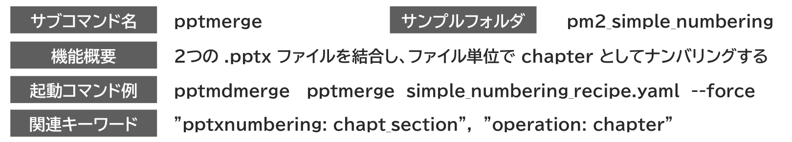
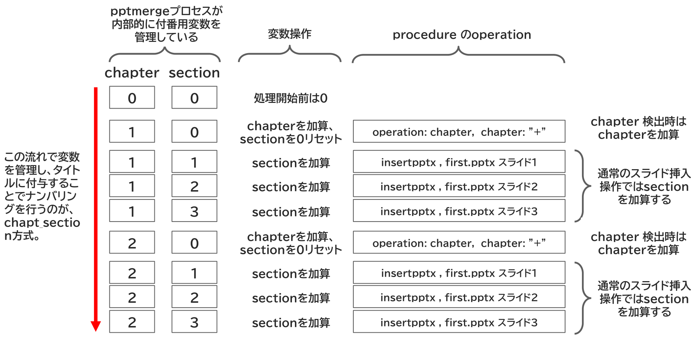

<!-- source: extracted/simple_numbering_guide_slide1_md.md -->
<!-- #id:section:simple_numbering_guide:slide1 -->
## simple_numbering　簡易ナンバリング

簡易ナンバリングは、2つの pptx ファイルを結合してファイル単位でchapterとしてナンバリングする機能です。

chapter とは日本語でいえば「章」のことで、 「1章2節」 のような、章・節によるナンバリングを行うにあたり、pptxファイルひとつを1章（chapter）と考えます。

このナンバリング方式を chapt_section 方式と呼びます、

処理のイメージは下記の通りです。

```{=latex}
\begin{center}
```

{ width=95% }

{ width=70% }


```{=latex}
\end{center}
```

<!-- source: D:/DOCS/SWPJs/new_md_merge/defaults/common_assets/tex_newpage.md -->

\newpage


<!-- source: extracted/simple_numbering_guide_slide2_md.md -->
<!-- #id:section:simple_numbering_guide:slide2 -->
## simple_numbering サンプル実行例

simple_numbering_guide.pptx は、２つのpptxファイルを結合して簡易ナンバリングを行うサンプルです。

データフォルダ:  PROJECT_ROOT/examples/pm2_simple_numbering
### サンプルファイル一覧

| 番号 | ファイル名         |          内容                |
| --- | --------------- | ------------------------ |
| 1 | simple_numbering_recipe.yaml | 結合指示書：簡易ナンバリング処理の仕様を示す  |
| 2 | simple_numbering_guide.pptx  |  このサンプルの説明書ソースpptx  |
| 3 | second.pptx                  | 結合元ファイルサンプル（3スライド）   |
| 4 | simple_numbering_merged.pptx       | 2と3の結合結果   |

ファイル2 + ファイル3 → ファイル4 という結合処理を行い、スライドタイトルに章・節番号をつけます。

### 実行命令

ファイル1の結合指示書に結合対象ファイルを記載します（後述します）。

以下の命令で実行します。サブコマンド pptmerge の引数に結合指示書を指定します。途中、一時的に PowerPoint が起動します。 --force は既出力ファイルを上書きするオプションです。

```bash
pptmdmerge pptmerge PROJECT_ROOT/examples/pm2_simple_numbering_recipe.yaml --force
```

結果、ファイル4が生成されれば成功です

<!-- source: D:/DOCS/SWPJs/new_md_merge/defaults/common_assets/tex_newpage.md -->

\newpage


<!-- source: extracted/simple_numbering_guide_slide3_md.md -->
<!-- #id:section:simple_numbering_guide:slide3 -->
## 簡易ナンバリング結果

実行後は2つのpptxファイルがマージ（結合）されています。

簡易ナンバリングを指定したので章・節番号がついて、pptxファイルが変わると新しい chapter となっています。

```{=latex}
\begin{center}
```

{ width=95% }

```{=latex}
\end{center}
```

<!-- source: D:/DOCS/SWPJs/new_md_merge/defaults/common_assets/tex_newpage.md -->

\newpage


<!-- source: extracted/simple_numbering_guide_slide4_md.md -->
<!-- #id:section:simple_numbering_guide:slide4 -->
## 結合指示書サンプル

indexer.pptxnumbering: という項目に chapt_section と記載すると、簡易ナンバリングを行います。

procedure の operation: chapter という項目で章番号のカウントアップを指示します。

```bash
 - operation: chapter                    # 章番号を付番する。
    chapter: "+" 
```


```{=latex}
\begin{center}
```

{ width=95% }

```{=latex}
\end{center}
```

<!-- source: D:/DOCS/SWPJs/new_md_merge/defaults/common_assets/tex_newpage.md -->

\newpage


<!-- source: extracted/simple_numbering_guide_slide5_md.md -->
<!-- #id:section:simple_numbering_guide:slide5 -->
## chap_section方式のアルゴリズム

chapt_section 方式は、pptmerge のプロセスが内部的に付番用変数を管理して行うものです。
chapter, section の変数はいずれも処理開始前は 0 であり、operation を経る都度、加算やリセットされます。"+" の部分を変えれば単純なカウントアップ以外の操作も可能です。

```bash
"+"  1 加算
"+2" 2 加算
"2" 2でリセットする
```

section はスライドが進むことにより自動的にカウントアップされます。
chapter 増やすにはここで説明した　operation: chapter の操作をするか、あるいは スライド上のマーカーによりカウントする方法もあります（別項目にて説明します）。


```{=latex}
\begin{center}
```

{ width=95% }

```{=latex}
\end{center}
```