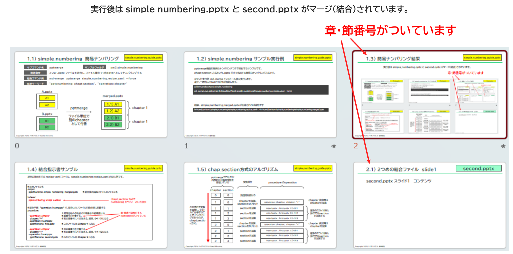

{{#id:section:simple_numbering_guide:slide3}}
## 簡易ナンバリング結果

実行後は2つのpptxファイルがマージ（結合）されています。

簡易ナンバリングを指定したので章・節番号がついて、pptxファイルが変わると新しい chapter となっています。

```{=latex}
\begin{center}
```

{ width=95% }

```{=latex}
\end{center}
```