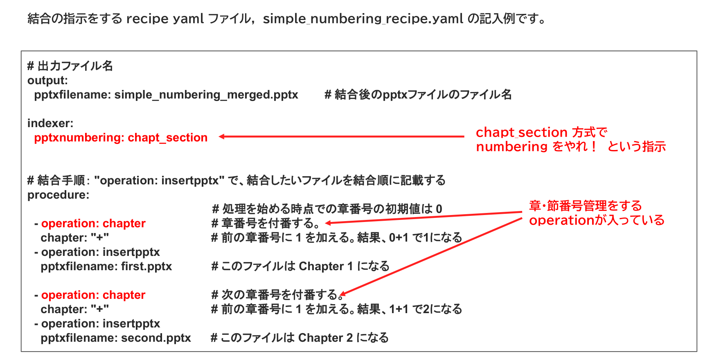

{{#id:section:simple_numbering_guide:slide4}}
## 結合指示書サンプル

indexer.pptxnumbering: という項目に chapt_section と記載すると、簡易ナンバリングを行います。

procedure の operation: chapter という項目で章番号のカウントアップを指示します。

```bash
 - operation: chapter                    # 章番号を付番する。
    chapter: "+" 
```


```{=latex}
\begin{center}
```

{ width=95% }

```{=latex}
\end{center}
```