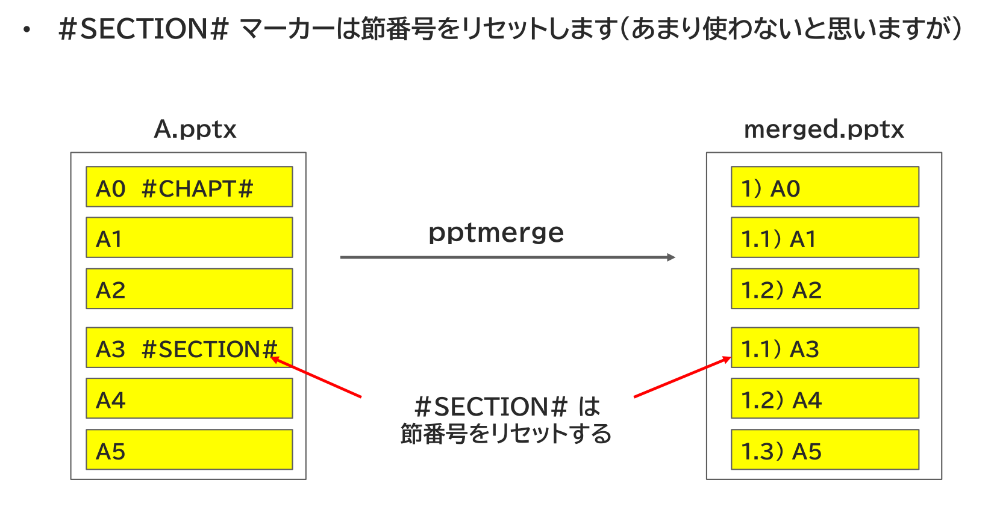
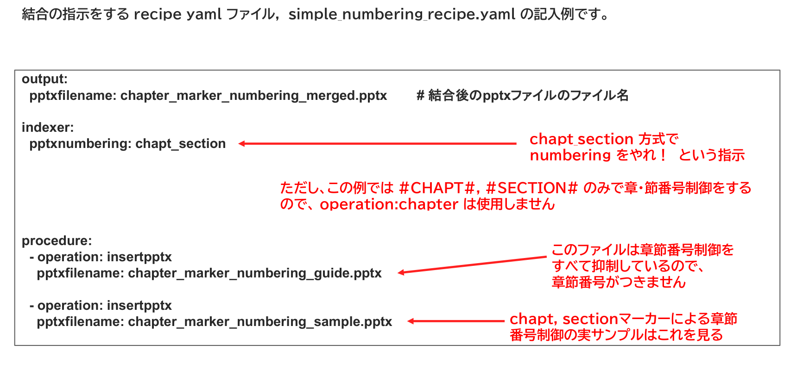

<!-- md_merge {{chapter:+}} {{title:}} -->
<!-- #id:chapter:AUTOCHAPTER:AUTOID_1 -->
# 

<!-- source: extracted/chapter_marker_numbering_guide_slide1_md.md -->
<!-- #id:section:chapter_marker_numbering_guide:slide1 -->
## 1.1) chapter_marker によるナンバリング

chapt_section ナンバリングにおいて、operation: chapter ではなく、スライド上の特殊文字列でカウントを行う方法があります。

スライド上のどこかにマーカー文字列 #CHAPT# を描いておくと、そのスライドを Chapter cover （章の表紙、章とびら）として扱うものです。

一般のスライドは "1.2) ・・・" のように　章・節番号　でナンバリングしますが、Chapter cover ページは章番号(Chapter番号)だけでナンバリングします。

処理のイメージは下記の通りです。

```{=latex}
\begin{center}
```

{ width=95% }

{ width=85% }

```{=latex}
\end{center}
```

<!-- source: D:/DOCS/SWPJs/new_md_merge/defaults/common_assets/tex_newpage.md -->

\newpage


<!-- source: extracted/chapter_marker_numbering_guide_slide2_md.md -->
<!-- #id:section:chapter_marker_numbering_guide:slide2 -->
## 1.2) #CHAPT# マーカーの埋め込み

マーカー式ナンバリングで使うマーカー文字列 #CHAPT# はスライド上のどこに置いてもかまいません。マージ処理の過程で消去されるので、目立つ大きさや色でもかまいません。ただし、画像ではダメで、テキストシェイプを使ってください。

#CHAPT# マーカーのあるスライドはそのChapterの先頭ですから、Chapter 全体の内容予告や概要説明を行うChapter cover を入れたいときに使うとよいでしょう。

処理のイメージは下記の通りです。

```{=latex}
\begin{center}
```

{ width=95% }

```{=latex}
\end{center}
```

<!-- source: D:/DOCS/SWPJs/new_md_merge/defaults/common_assets/tex_newpage.md -->

\newpage


<!-- source: extracted/chapter_marker_numbering_guide_slide3_md.md -->
<!-- #id:section:chapter_marker_numbering_guide:slide3 -->
## 1.3) 1ファイル中の複数 #CHAPT# も可能

ひとつのファイルの中に複数の #CHAPT# を入れてもかまいません。1ファイル中に複数の Chapter を含むような大きな文書部品もこの方法でナンバリングできます。

```{=latex}
\begin{center}
```

{ width=95% }

```{=latex}
\end{center}
```

<!-- source: D:/DOCS/SWPJs/new_md_merge/defaults/common_assets/tex_newpage.md -->

\newpage


<!-- source: extracted/chapter_marker_numbering_guide_slide4_md.md -->
<!-- #id:section:chapter_marker_numbering_guide:slide4 -->
## 1.4) #SECTION# マーカーは節番号をリセット

#SECTION# マーカーは節番号をリセットします。
あまり使わないと思いますが、たとえば章・節番号が同じで微妙に内容の違うスライドを出したい時には使えるかもしれません。
（ただしその場合は operation: chapter や section で章・節番号をセットするほうが扱いやすいと思いますが）


```{=latex}
\begin{center}
```

{ width=95% }

```{=latex}
\end{center}
```

<!-- source: D:/DOCS/SWPJs/new_md_merge/defaults/common_assets/tex_newpage.md -->

\newpage


<!-- source: extracted/chapter_marker_numbering_guide_slide5_md.md -->
<!-- #id:section:chapter_marker_numbering_guide:slide5 -->
## 1.5) 結合指示書サンプル

マーカー方式で章・節ナンバリングをする結合指示書のサンプルです。

pptxnumbering: chapt_section は変わりませんが、ナンバリングそのものはマーカーで行うため、procedureには chapter も section も現れません。

なお、２つの結合ファイルのうち１つ目の chapter_marker_numbering_guide.pptx では章・節番号制御をすべて抑制しているので章・節番号がつきません。

#CHAPT#, #SECTION# マーカーによる制御の実サンプルは、２つめの結合ファイルである chapter_marker_numbering_sample.pptx に該当する部分が結合後pptxの中でどうなっているかをご覧ください。


```{=latex}
\begin{center}
```

{ width=95% }

```{=latex}
\end{center}
```