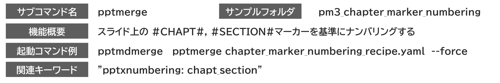

{{#id:section:chapter_marker_numbering_guide:slide1}}
## chapter_marker によるナンバリング

chapt_section ナンバリングにおいて、operation: chapter ではなく、スライド上の特殊文字列でカウントを行う方法があります。

スライド上のどこかにマーカー文字列 #CHAPT# を描いておくと、そのスライドを Chapter cover （章の表紙、章とびら）として扱うものです。

一般のスライドは "1.2) ・・・" のように　章・節番号　でナンバリングしますが、Chapter cover ページは章番号(Chapter番号)だけでナンバリングします。

処理のイメージは下記の通りです。

```{=latex}
\begin{center}
```

{ width=95% }

{ width=85% }

```{=latex}
\end{center}
```