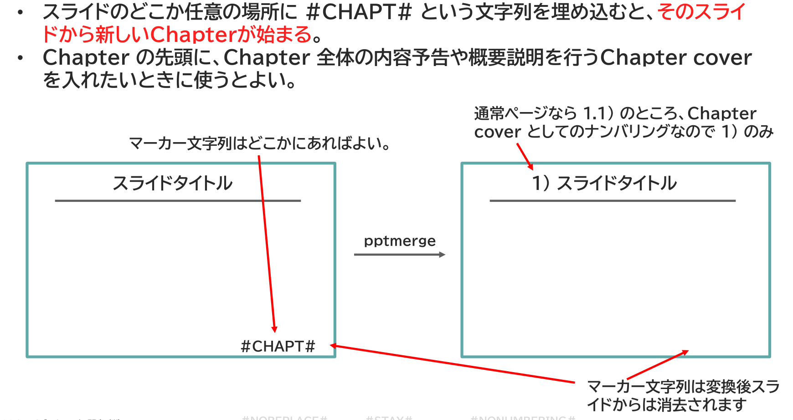

{{#id:section:chapter_marker_numbering_guide:slide2}}
## #CHAPT# マーカーの埋め込み

マーカー式ナンバリングで使うマーカー文字列 #CHAPT# はスライド上のどこに置いてもかまいません。マージ処理の過程で消去されるので、目立つ大きさや色でもかまいません。ただし、画像ではダメで、テキストシェイプを使ってください。

#CHAPT# マーカーのあるスライドはそのChapterの先頭ですから、Chapter 全体の内容予告や概要説明を行うChapter cover を入れたいときに使うとよいでしょう。

処理のイメージは下記の通りです。

```{=latex}
\begin{center}
```

{ width=95% }

```{=latex}
\end{center}
```