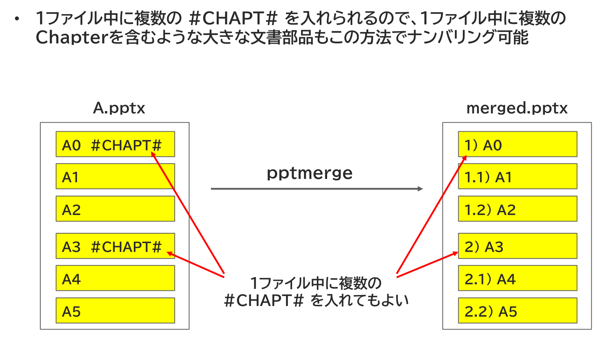

{{#id:section:chapter_marker_numbering_guide:slide3}}
## 1ファイル中の複数 #CHAPT# も可能

ひとつのファイルの中に複数の #CHAPT# を入れてもかまいません。1ファイル中に複数の Chapter を含むような大きな文書部品もこの方法でナンバリングできます。

```{=latex}
\begin{center}
```

{ width=95% }

```{=latex}
\end{center}
```