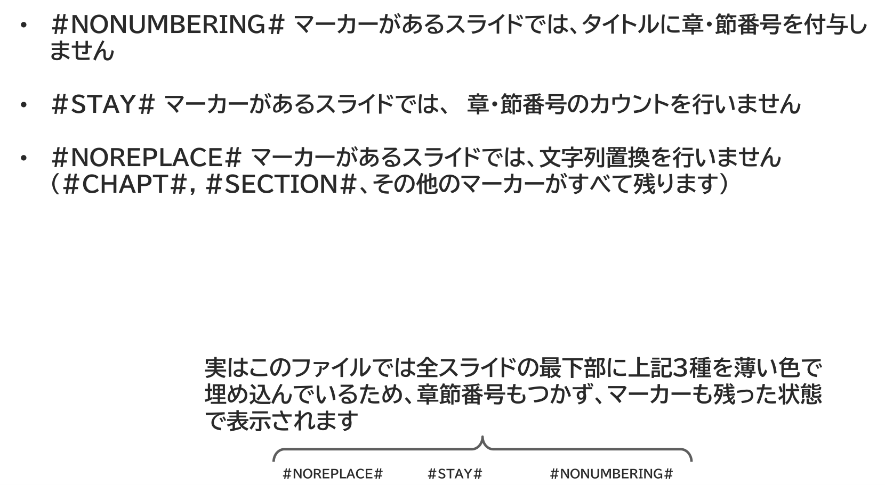

{{#id:section:chapter_marker_numbering_guide:slide6}}
## 章節番号制御・文字列置換を抑制する

他にもいくつかのマーカーがあります。

#NONUMBERING# マーカーがあるスライドでは、タイトルに章・節番号を付与しません

#STAY# マーカーがあるスライドでは、　章・節番号のカウントを行いません

#NOREPLACE# マーカーがあるスライドでは、文字列置換を行いません 
（#CHAPT#, #SECTION#、その他のマーカーがすべて残ります）


```{=latex}
\begin{center}
```

{ width=95% }

```{=latex}
\end{center}
```