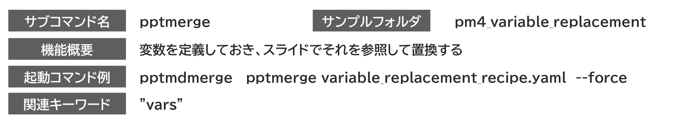

<!-- md_merge } } -->
<!-- #id:chapter:AUTOCHAPTER:AUTOID_1 -->
#

<!-- source: extracted/variable_replacement_guide_slide1_md.md -->
<!-- #id:section:variable_replacement_guide:slide1 -->
## スライド中の変数置換

変数置換はスライド上に差し替え可能なプレースホルダーを用意しておき、設定ファイルの変数でそれを差し替え表示することです。

変数の有効範囲はファイル全体に適用することも、1つのoperation限定で適用することもできます。

<!-- source: D:/DOCS/SWPJs/md_merge/defaults/common_assets/tex_newpage.md -->

<!-- source: extracted/variable_replacement_guide_slide2_md.md -->
<!-- #id:section:variable_replacement_guide:slide2 -->
## 結合指示書サンプル

結合指示書の vars: セクションで変数を定義します。

procedure外で定義するとすべてのoperationで有効になり、operationで定義するとそのoperationでだけ有効です。

グローバルな設定をoperation で上書きすることもできます。

