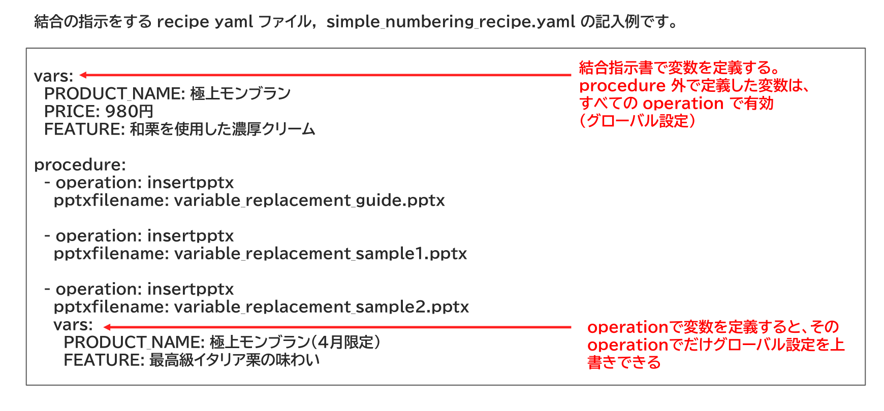

{{#id:section:variable_replacement_guide:slide2}}
## 結合指示書サンプル

結合指示書の vars: セクションで変数を定義します。

procedure外で定義するとすべてのoperationで有効になり、operationで定義するとそのoperationでだけ有効です。

グローバルな設定をoperation で上書きすることもできます。


```{=latex}
\begin{center}
```

{ width=95% }

```{=latex}
\end{center}
```