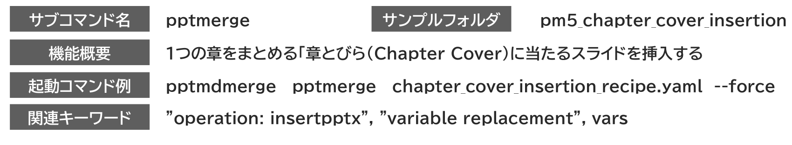
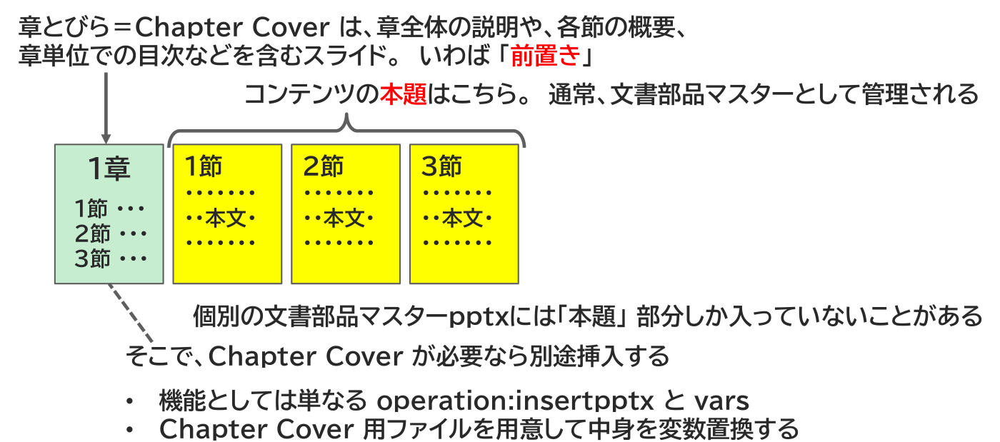

{{#id:section:chapter_cover_insertion_guide:slide1}}
## Chapter Cover 挿入運用

章・節、つまり Chapter/Section 構造の書籍にはしばしば 「章とびら（Chapter Cover）」 をつけます。これは章全体の説明や、各節の概要、章単位での目次などを含むスライドであり、いわば  **「前置き」** です。

それに対して、本題は **「節」** の部分に記述します。通常、この部分を文書部品マスターとして個別の pptx ファイルとして管理します。つまり、個別の文書部品マスターpptxには「本題」 部分しか入っていないことがあります。

そこで、Chapter Cover が必要なら別途挿入します。

```{=latex}
\par\vspace{1\baselineskip}
\begin{center}
```

{ width=95% }

{ width=80% }


```{=latex}
\end{center}
\par\vspace{1\baselineskip}
```

機能としては単なる operation:insertpptx と varsであり、Chapter Cover 用ファイルを用意して中身を変数置換することで実現します。