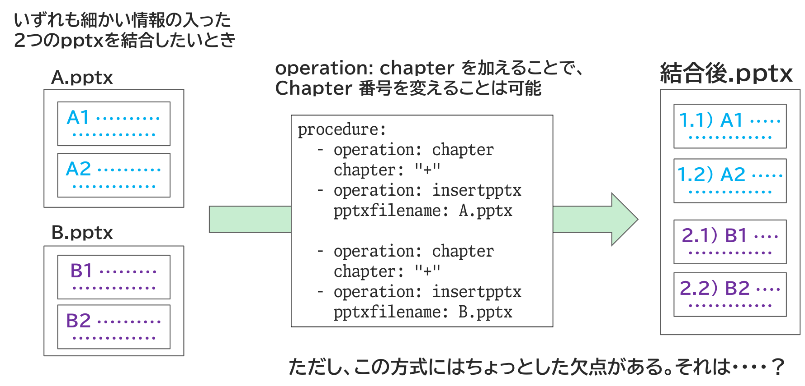

{{#id:section:chapter_cover_insertion_guide:slide2}}
## operation: chapter が使いにくい問題

Chapter Cover 挿入運用の詳しい説明をします。

たとえばいずれも細かい情報の入った２つのpptxを結合したい、その際、話題が違うので Chapter 番号を変えたいとします。 operation: chapter を加えることで、Chapter 番号を変えること自体は可能ですが、この方式にはちょっとした欠点があります。

```{=latex}
\par\vspace{1\baselineskip}
\begin{center}
```

{ width=95% }

```{=latex}
\end{center}
\par\vspace{1\baselineskip}
```