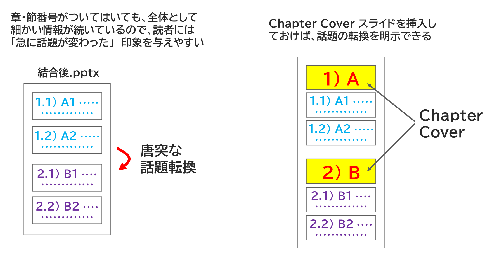

{{#id:section:chapter_cover_insertion_guide:slide3}}
## Chapter Cover で話題の転換を明示したい

章・節番号がついてはいても、全体として細かい情報が続いているので、読者には　「急に話題が変わった」　印象を与えやすいのです。

```{=latex}
\par\vspace{1\baselineskip}
\begin{center}
```

{ width=95% }

```{=latex}
\end{center}
\par\vspace{1\baselineskip}
```

はっきりとデザインの違う Chapter Cover スライドを挿入しておけば、この問題を解決できます。