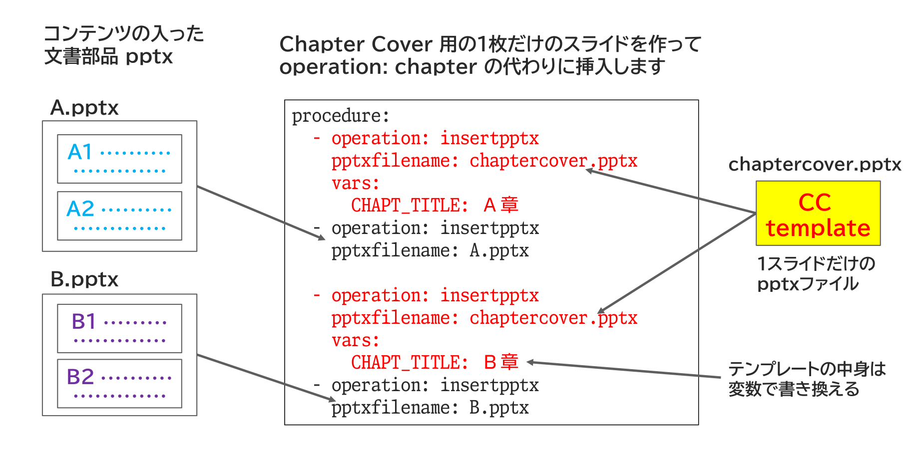

{{#id:section:chapter_cover_insertion_guide:slide4}}
## Chapter Cover の挿入方法

そこで、Chapter Cover 用の1枚だけのスライドを作ってoperation: chapter の代わりに operation: insertpptx で挿入します。

ただし、同じファイルだとChapterが分からないので、テンプレートの中身を変数で書き換えられるようにします。

```{=latex}
\par\vspace{1\baselineskip}
\begin{center}
```

{ width=95% }

```{=latex}
\end{center}
\par\vspace{1\baselineskip}
```