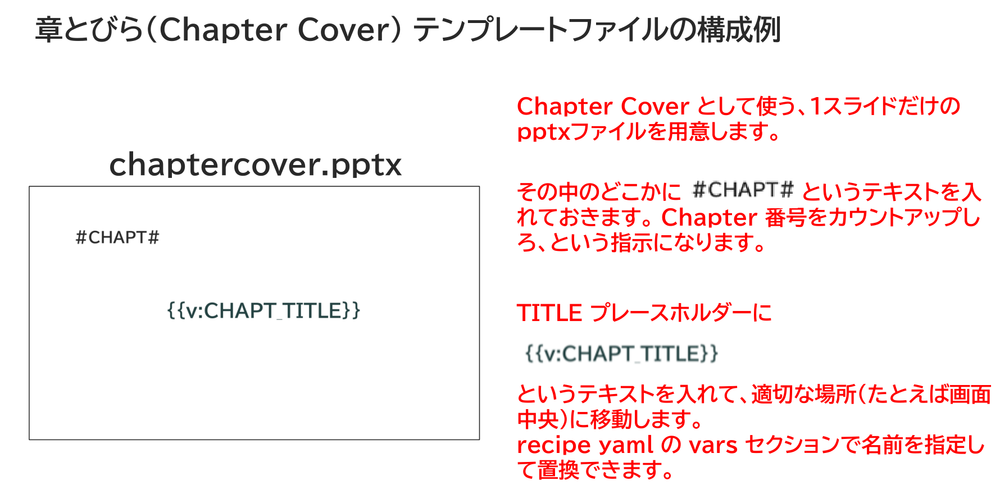

{{#id:section:chapter_cover_insertion_guide:slide5}}
## Chapter Cover テンプレートファイルの作り方

Chapter Cover テンプレートファイルの作り方です。

#CHAPT# マーカーを入れておくこと、TITLE プレースホルダーに置換用の変数を入れておくことがポイントです。

```{=latex}
\par\vspace{1\baselineskip}
\begin{center}
```

{ width=95% }

```{=latex}
\end{center}
\par\vspace{1\baselineskip}
```

概要説明文やChapter目次やも入れたければ、それも変数にしておけば置き換えられます。