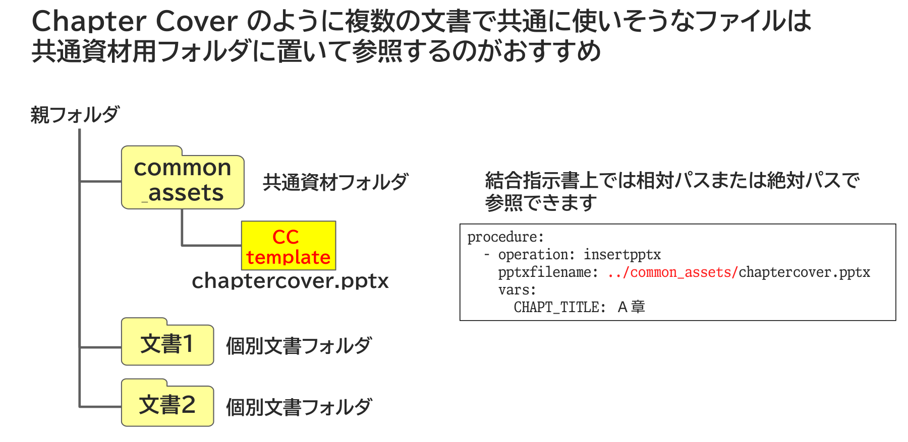

{{#id:section:chapter_cover_insertion_guide:slide6}}
## 共通資材は共通資材のフォルダに

Chapter Cover のように複数の文書で共通に使いそうなファイルは共通資材用フォルダに置いて参照するのがおすすめです。

結合指示書上では相対パスまたは絶対パスで参照できます。

```{=latex}
\par\vspace{1\baselineskip}
\begin{center}
```

{ width=95% }

```{=latex}
\end{center}
\par\vspace{1\baselineskip}
```