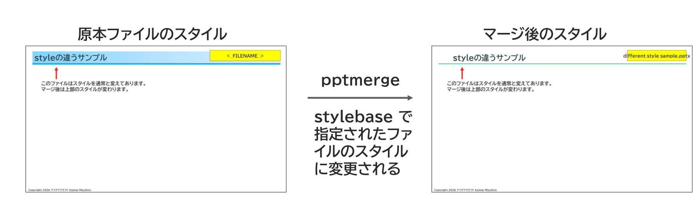

{{#id:section:different_style_sample:slide1}}
## styleの違うサンプル

左側が different_style_sample.pptx のスタイルです。　それがマージ後の stylebase_merged.pptx 末尾では右側のスタイルに変更されていることを確認してください。

```{=latex}
\par\vspace{1\baselineskip}
\begin{center}
```

{ width=95% }

```{=latex}
\end{center}
\par\vspace{1\baselineskip}
```