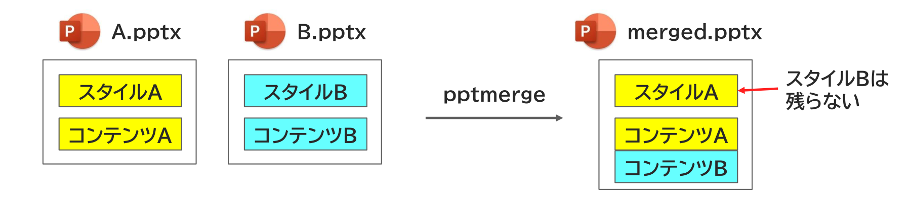

{{#id:section:stylebase_guide:slide2}}
## なぜstylebaseを別途指定すべき？

一般に、pptxファイルにはスタイル情報とコンテンツが含まれており、複数のファイルの
マージ処理(pptmerge)では　「コンテンツ」 を結合します。

スタイル情報は最初のファイルのものだけが使われます。

```{=latex}
\par\vspace{1\baselineskip}
\begin{center}
```

{ width=95% }

```{=latex}
\end{center}
\par\vspace{1\baselineskip}
```

しかし、コンテンツファイルは一般に頻繁に更新されるものです。

コンテンツとスタイルを混在させていると　 **「うっかり、スタイルまで更新してしまう」** 　事態が起きます。　

スタイルが合わないとレイアウト崩れ、配色崩れなどが起きるため、スタイル情報はコンテンツとは別に管理することが望ましいのです。