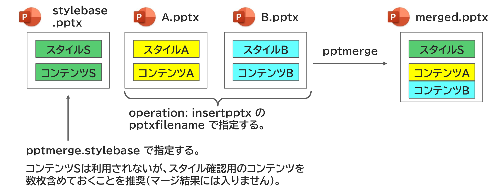

{{#id:section:stylebase_guide:slide3}}
## stylebaseを別途指定するしくみ

そこで、スタイル情報を別のファイルに分離することを推奨します。　

スタイル情報は一般に、複数の文書、複数のプロジェクトで共通に使われるものなので、共通資材フォルダに置くとよいでしょう。

```{=latex}
\par\vspace{1\baselineskip}
\begin{center}
```

{ width=95% }

```{=latex}
\end{center}
\par\vspace{1\baselineskip}
```