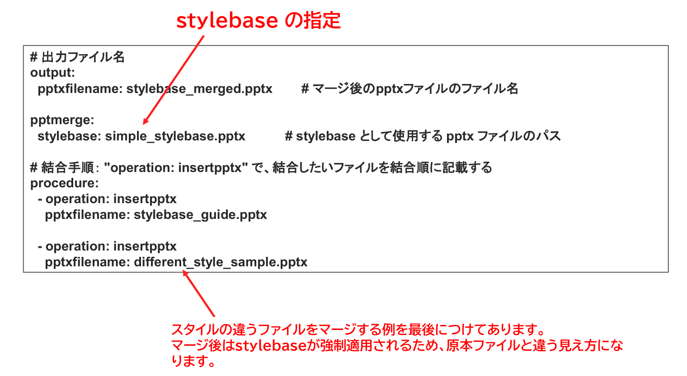

{{#id:section:stylebase_guide:slide4}}
## 結合指示書サンプル

サンプルファイルとして、マージによってスタイルが変わる例を格納してあります。

different_style_sample.pptx は simple_stylebase.pptx とは違うスタイルで作られていますが、マージ後の stylebase_merged.pptx を見ると simple_stylebase.pptx のスタイルに変更されています。

```{=latex}
\par\vspace{1\baselineskip}
\begin{center}
```

{ width=95% }

```{=latex}
\end{center}
\par\vspace{1\baselineskip}
```