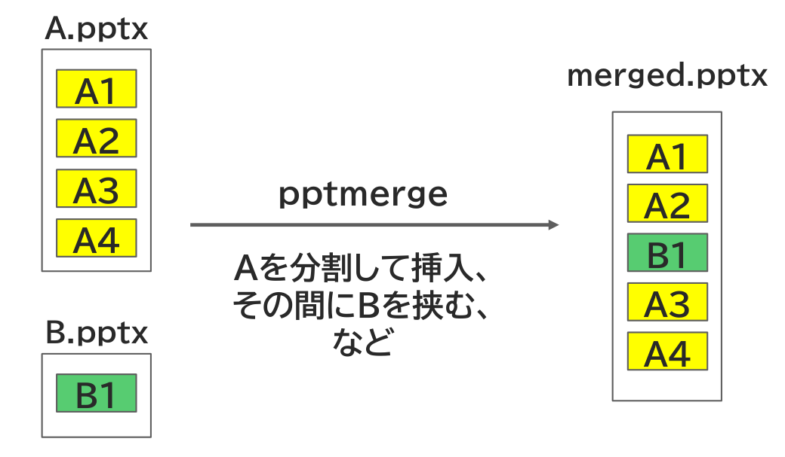
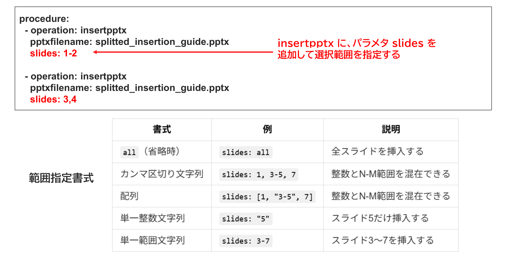

<!-- source: extracted/splitted_insertion_guide_slide1_md.md -->
<!-- #id:section:splitted_insertion_guide:slide1 -->
## ファイルを分割して挿入する

pptxをマージする際、ファイル全体ではなく一部を選択して結合することができます。たとえば全体で4スライドあってもそのうちの2スライドのみ使う、といったことができます。


```{=latex}
\par\vspace{1\baselineskip}
\begin{center}
```

{ width=95% }

{ width=60% }


```{=latex}
\end{center}
\par\vspace{1\baselineskip}
```

<!-- source: extracted/splitted_insertion_guide_slide2_md.md -->
<!-- #id:section:splitted_insertion_guide:slide2 -->
## 分割挿入を使いたいのはどんなとき？

たとえば、既存の pptx ファイルに手を入れず、コピーも作らずに、

- 途中に臨時に別なスライドを差し込みたい
- 中の一部スライドのみ使いたい

といった事情があるときは分割挿入機能を使いましょう。

```{=latex}
\par\vspace{1\baselineskip}
\begin{center}
```

{ width=95% }

```{=latex}
\end{center}
\par\vspace{1\baselineskip}
```

<!-- source: D:/DOCS/SWPJs/md_merge/defaults/common_assets/tex_newpage.md -->

\newpage


<!-- source: extracted/splitted_insertion_guide_slide3_md.md -->
<!-- #id:section:splitted_insertion_guide:slide3 -->
## 結合指示書サンプル

分割挿入をするには、operation: insertpptx に slides: パラメータを追加します。 slides を省略すると all 扱いになります。スライド番号は1オリジンです。

```{=latex}
\par\vspace{1\baselineskip}
\begin{center}
```

{ width=95% }

```{=latex}
\end{center}
\par\vspace{1\baselineskip}
```