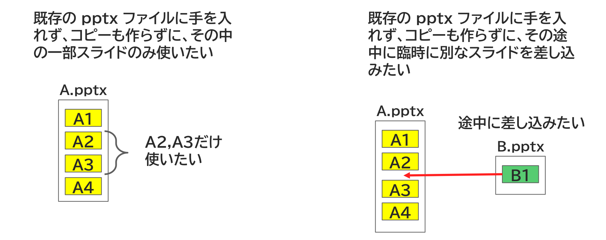

{{#id:section:splitted_insertion_guide:slide2}}
## 分割挿入を使いたいのはどんなとき？

たとえば、既存の pptx ファイルに手を入れず、コピーも作らずに、

- 途中に臨時に別なスライドを差し込みたい
- 中の一部スライドのみ使いたい

といった事情があるときは分割挿入機能を使いましょう。

```{=latex}
\par\vspace{1\baselineskip}
\begin{center}
```

{ width=95% }

```{=latex}
\end{center}
\par\vspace{1\baselineskip}
```