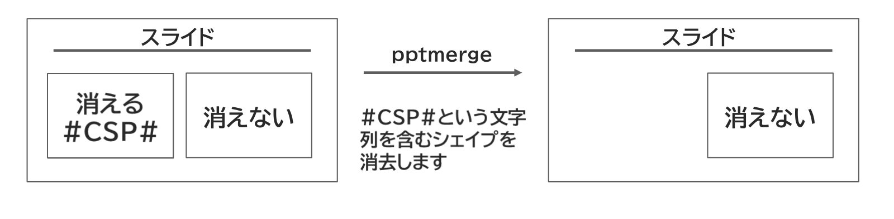
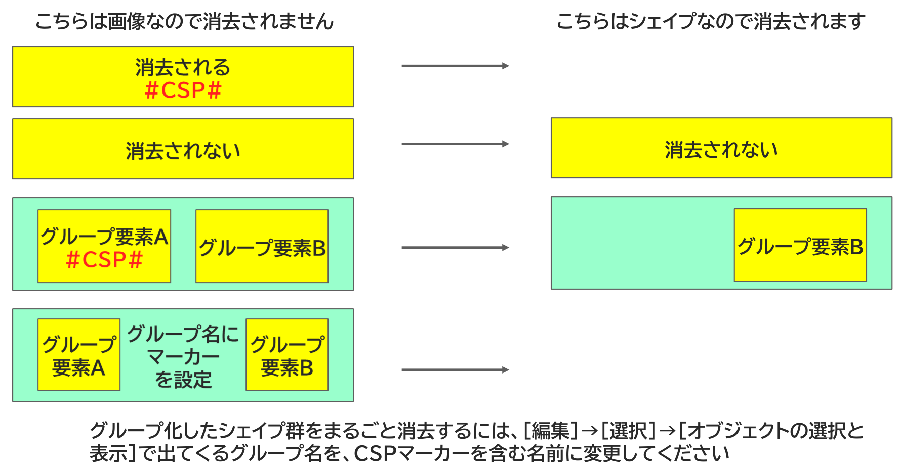

<!-- source: extracted/delete_csp_guide_slide1_md.md -->
<!-- #id:section:delete_csp_guide:slide1 -->
## 指定したシェイプを消去する

研修テキストのような資料を作るときは、配付資料にはすべての情報を載せず、講師用には載せておく、という2種類のテキストを作る必要があります。そこで使えるのが、指定したシェイプ（図形）をオプションにより自動削除する機能です。

配付資料には載せたくないシェイプに特殊マーカーを記入しておくと、マージ時に一括して消去する機能です。

結合指示書による on/off が可能で、起動時オプションでも設定できるので、講師用/受講者用の2種類を簡単に生成しわけられます。

```{=latex}
\par\vspace{1\baselineskip}
\begin{center}
```

{ width=95% }

{ width=80% }


```{=latex}
\end{center}
\par\vspace{1\baselineskip}
```

<!-- source: D:/DOCS/SWPJs/new_md_merge/defaults/common_assets/tex_newpage.md -->

\newpage


<!-- source: extracted/delete_csp_guide_slide2_md.md -->
<!-- #id:section:delete_csp_guide:slide2 -->
## 消去したいシェイプにCSPマーカーを入れておく

消去したいシェイプの一部に #CSP# というマーカーを含めておくと、 recipe yamlの indexer.deletecsp 設定 または --deletecsp オプションにより自動的に消去できます。

deletecsp がfalseまたは未指定の場合は、#CSP#マーカーだけが消去されます。

```{=latex}
\par\vspace{1\baselineskip}
\begin{center}
```

{ width=95% }

```{=latex}
\end{center}
\par\vspace{1\baselineskip}
```

<!-- source: D:/DOCS/SWPJs/new_md_merge/defaults/common_assets/tex_newpage.md -->

\newpage


<!-- source: extracted/delete_csp_guide_slide4_md.md -->
<!-- #id:section:delete_csp_guide:slide4 -->
## CSPマーカー利用例

CSPマーカーの基本的な利用イメージです。左側が原本ファイル、deletecsl 有効なマージ後は右側の状態になります。

グループ化したシェイプをまるごと削除するには 「グループ名」 にCSPマーカーを設定する必要があることに注意してください。

```{=latex}
\par\vspace{1\baselineskip}
\begin{center}
```

{ width=95% }

```{=latex}
\end{center}
\par\vspace{1\baselineskip}
```

<!-- source: D:/DOCS/SWPJs/new_md_merge/defaults/common_assets/tex_newpage.md -->

\newpage


<!-- source: extracted/delete_csp_guide_slide6_md.md -->
<!-- #id:section:delete_csp_guide:slide6 -->
## テーブルシェイプはテーブルごと消去

テーブルセルに CSPマーカーがある場合は、テーブルごと消去されます。

```{=latex}
\par\vspace{1\baselineskip}
\begin{center}
```

{ width=95% }

```{=latex}
\end{center}
\par\vspace{1\baselineskip}
```

<!-- source: D:/DOCS/SWPJs/new_md_merge/defaults/common_assets/tex_newpage.md -->

\newpage


<!-- source: extracted/delete_csp_guide_slide7_md.md -->
<!-- #id:section:delete_csp_guide:slide7 -->
## シェイプを残して文字列だけ消去するには？

手書き記入用の穴埋め欄を作る場合など、　「シェイプは残して、文字列だけ消去したい」 場合は 「文字列」 を別シェイプで作って重ねてください。

```{=latex}
\par\vspace{1\baselineskip}
\begin{center}
```

{ width=95% }

```{=latex}
\end{center}
\par\vspace{1\baselineskip}
```