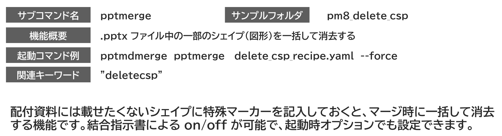

{{#id:section:delete_csp_guide:slide1}}
## 指定したシェイプを消去する

研修テキストのような資料を作るときは、配付資料にはすべての情報を載せず、講師用には載せておく、という2種類のテキストを作る必要があります。そこで使えるのが、指定したシェイプ（図形）をオプションにより自動削除する機能です。

配付資料には載せたくないシェイプに特殊マーカーを記入しておくと、マージ時に一括して消去する機能です。

結合指示書による on/off が可能で、起動時オプションでも設定できるので、講師用/受講者用の2種類を簡単に生成しわけられます。

```{=latex}
\par\vspace{1\baselineskip}
\begin{center}
```

{ width=95% }

{ width=80% }


```{=latex}
\end{center}
\par\vspace{1\baselineskip}
```