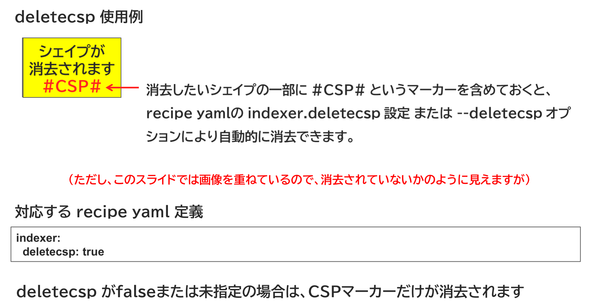

{{#id:section:delete_csp_guide:slide2}}
## 消去したいシェイプにCSPマーカーを入れておく

消去したいシェイプの一部に #CSP# というマーカーを含めておくと、 recipe yamlの indexer.deletecsp 設定 または --deletecsp オプションにより自動的に消去できます。

deletecsp がfalseまたは未指定の場合は、#CSP#マーカーだけが消去されます。

```{=latex}
\par\vspace{1\baselineskip}
\begin{center}
```

{ width=95% }

```{=latex}
\end{center}
\par\vspace{1\baselineskip}
```