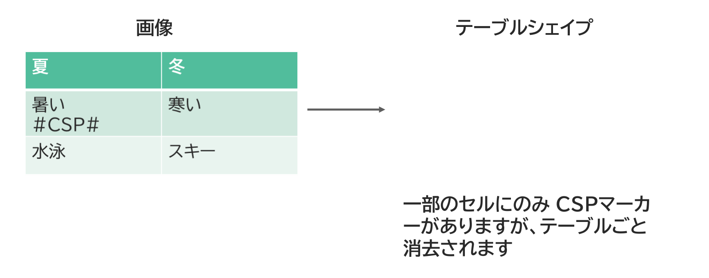

{{#id:section:delete_csp_guide:slide6}}
## テーブルシェイプはテーブルごと消去

テーブルセルに CSPマーカーがある場合は、テーブルごと消去されます。

```{=latex}
\par\vspace{1\baselineskip}
\begin{center}
```

{ width=95% }

```{=latex}
\end{center}
\par\vspace{1\baselineskip}
```