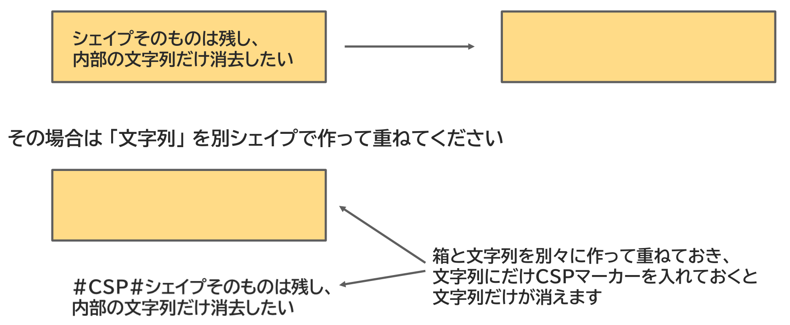

{{#id:section:delete_csp_guide:slide7}}
## シェイプを残して文字列だけ消去するには？

手書き記入用の穴埋め欄を作る場合など、　「シェイプは残して、文字列だけ消去したい」 場合は 「文字列」 を別シェイプで作って重ねてください。

```{=latex}
\par\vspace{1\baselineskip}
\begin{center}
```

{ width=95% }

```{=latex}
\end{center}
\par\vspace{1\baselineskip}
```