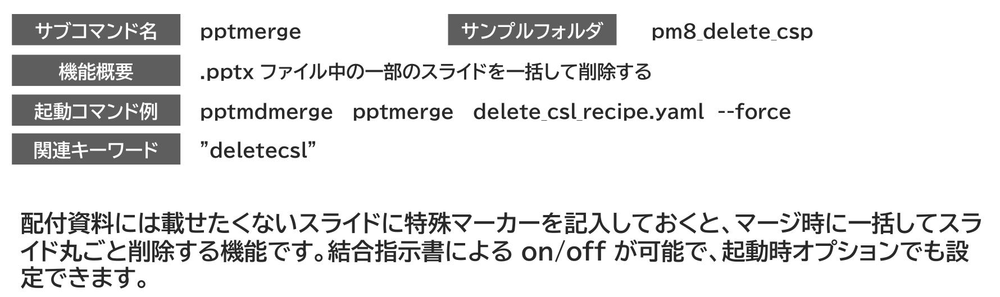
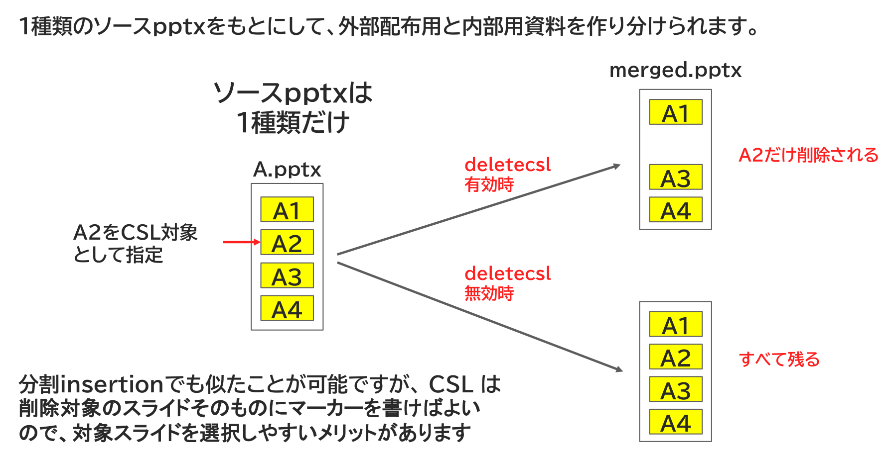
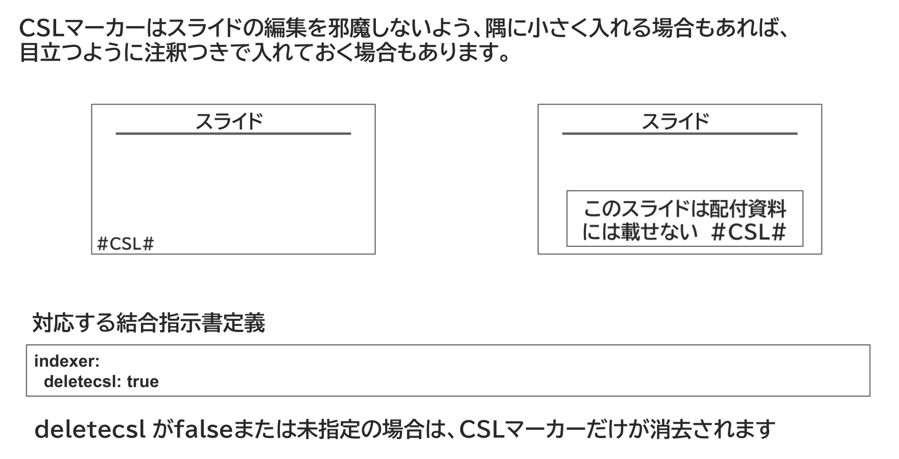

<!-- source: extracted/delete_csl_guide_slide2_md.md -->
<!-- #id:section:delete_csl_guide:slide2 -->
## 指定したスライドを削除する

研修テキストのような資料を作るときは、１スライドまるごと配付資料から削除したいときもあります。

そこで使えるのが配付資料には載せたくないスライドに特殊マーカーを記入しておくと、マージ時に一括してスライドごと削除する機能です。

結合指示書による on/off が可能で、起動時オプションでも設定できるので、講師用/受講者用の2種類を簡単に生成しわけられます。

```{=latex}
\par\vspace{1\baselineskip}
\begin{center}
```

{ width=95% }

{ width=80% }


```{=latex}
\end{center}
\par\vspace{1\baselineskip}
```

<!-- source: D:/DOCS/SWPJs/new_md_merge/defaults/common_assets/tex_newpage.md -->

\newpage


<!-- source: extracted/delete_csl_guide_slide3_md.md -->
<!-- #id:section:delete_csl_guide:slide3 -->
## スライド削除機能の動作イメージ

スライド削除機能を使うと、1種類のソースpptxをもとにして、外部配布用と内部用資料を作り分けられます。

分割insertionでも似たことが可能ですが、 CSL は削除対象のスライドそのものにマーカーを書けばよいので、対象スライドを選択しやすいメリットがあります。

```{=latex}
\par\vspace{1\baselineskip}
\begin{center}
```

{ width=95% }

```{=latex}
\end{center}
\par\vspace{1\baselineskip}
```

<!-- source: D:/DOCS/SWPJs/new_md_merge/defaults/common_assets/tex_newpage.md -->

\newpage


<!-- source: extracted/delete_csl_guide_slide5_md.md -->
<!-- #id:section:delete_csl_guide:slide5 -->
## CSLマーカーの入れ方と結合指示書の記入

CSLマーカーはスライドの編集を邪魔しないよう、隅に小さく入れる場合もあれば、目立つように注釈つきで入れておく場合もあります。

結合指示書で  indexer.deletecsl: true とするか、--deletecsl オプションにより CSLが有効になります。

deletecsl がfalseまたは未指定の場合は、CSLマーカーだけが消去されます。

```{=latex}
\par\vspace{1\baselineskip}
\begin{center}
```

{ width=95% }

```{=latex}
\end{center}
\par\vspace{1\baselineskip}
```